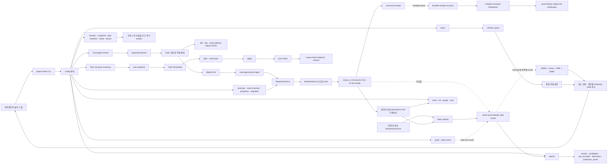

# Project Brain 런타임 지도

이 문서는 현재 CLI, 객체 코퍼스, 로컬 파생물 사이의 실행·쓰기 경계를 코드 경로와 함께
설명한다. 아래 JSON 블록은 사람이 읽는 설명과 CLI가 어긋나는지 테스트가 확인하는 기계 판독
계약이다. 명령이나 `MutationOperation`을 추가하면 코드와 이 블록을 같은 변경에서 갱신한다.

<!-- architecture-contract:start -->
```json
{
  "schema_version": 1,
  "top_level_commands": [
    "audit", "bootstrap", "build", "context-replace", "doctor", "eval", "graph",
    "index", "ingest", "install", "lint", "mark-checked", "migration", "projection",
    "promote", "promote-auto", "query", "search", "session", "show", "snapshot",
    "stale-check"
  ],
  "subcommand_paths": [
    "context-replace apply", "context-replace plan", "graph export", "graph isolated",
    "index rebuild", "migration canonical-repair apply", "migration canonical-repair plan",
    "migration display apply", "migration display binding-create",
    "migration display binding-verify", "migration display closure-create",
    "migration display closure-verify", "migration display plan",
    "migration display post-verify", "migration display verify-plan",
    "migration id apply", "migration id plan", "migration quote-debt build",
    "migration quote-debt verify", "projection build-reuse", "projection refresh",
    "session complete", "session list", "session mark-processed", "snapshot create", "snapshot restore",
    "snapshot verify"
  ],
  "mutation_operations": [
    "canonical_repair", "context_replace", "display_migration", "id_only_migration",
    "ingest", "mark_checked", "projection", "projection_repair", "promote",
    "promote_auto"
  ],
  "source_paths": [
    "src/project_brain/assembly.py", "src/project_brain/audit.py",
    "src/project_brain/cli.py", "src/project_brain/config.py",
    "src/project_brain/context_projection.py", "src/project_brain/corpus_io.py",
    "src/project_brain/id_grammar.py", "src/project_brain/installer.py",
    "src/project_brain/lint.py", "src/project_brain/migration.py",
    "src/project_brain/mutation.py", "src/project_brain/quote_debt.py",
    "src/project_brain/reference_fields.py", "src/project_brain/router.py",
    "src/project_brain/schema.py", "src/project_brain/search.py",
    "src/project_brain/search_index.py", "src/project_brain/session.py",
    "src/project_brain/snapshot.py", "src/project_brain/store.py",
    "src/project_brain/surface.py", "src/project_brain/task18_binding.py",
    "src/project_brain/task18_binding_verify.py", "src/project_brain/task18_state.py",
    "src/project_brain/task18_verify.py"
  ],
  "test_paths": [
    "tests/test_architecture_docs.py", "tests/test_assembly.py", "tests/test_audit.py",
    "tests/test_cli.py", "tests/test_code_verify.py", "tests/test_context_projection.py",
    "tests/test_context_replace.py", "tests/test_corpus_io.py", "tests/test_id_grammar.py",
    "tests/test_ingest.py", "tests/test_installer.py", "tests/test_lint.py",
    "tests/test_migration.py", "tests/test_mutation.py", "tests/test_quote_debt.py",
    "tests/test_router.py",
    "tests/test_schema.py", "tests/test_search.py", "tests/test_search_index.py",
    "tests/test_session.py", "tests/test_snapshot.py", "tests/test_stale_check.py",
    "tests/test_task18_binding.py", "tests/test_task18_binding_verify.py",
    "tests/test_task18_state.py", "tests/test_task18_verify.py"
  ],
  "doc_paths": [
    "AGENTS.md", "README.md", "ROADMAP.md", "docs/design-canonical.md",
    "docs/search-internals.md", "docs/architecture/README.md",
    "docs/architecture/runtime-map.md", "docs/architecture/data-contracts.md",
    "docs/architecture/change-map.md"
  ]
}
```
<!-- architecture-contract:end -->

## 전체 실행 흐름



정본 CLI에서 quote inventory 생성은 `--target-revision`으로 exact commit을 고정하고,
binding 생성 출력은 `--binding`에 쓴다. 최종 closure 생성은 `--corpus-snapshot`,
`--snapshot-verify`, `--expected-engine-head`, `--expected-bb2-head`를 함께 결속해
`--report` 자체를 closure receipt로 만든다. 독립 검증은 같은 receipt를 `--closure`로
받으며 생성 시각을 다시 입력받지 않는다.

## 저장면과 권위

| 저장면 | 쓰는 주체 | 권위와 수명 | 다시 만드는 방법 |
|---|---|---|---|
| `BrainStore.object_path()`가 정하는 모든 kind 디렉터리 | 정상 편집은 `MutationService`의 plan과 `corpus_io` transaction | 검수 상태가 붙은 구조화 지식 정본. `objects/**`뿐 아니라 `raw/manifests/**`, `indexes/context_projections/**`, `indexes/records/**`, `views/**`도 포함 | 원본·근거로 다시 적재할 수는 있지만 파생물로 취급하지 않음 |
| `brain/raw/sources/**` | 소비 데이터 작업의 사람·설치된 적재 스킬. 엔진 CLI에는 직접 writer가 없음 | 검수 전 원문 정본. `raw/manifests/**`의 EvidenceManifest 객체와 다른 경계 | 원출처에서 다시 확보해야 하므로 index처럼 지우지 않음 |
| `.brain-local/index.db*` | `index rebuild`, `bootstrap`, 적재 finalizer | 객체와 raw로부터 만든 로컬 파생 색인 | `project-brain index rebuild` |
| `.brain-local/stale-set.json` | `stale-check --write-cache`, `audit --write-stale-cache` | query/show가 읽는 계산 결과 cache | 명시적 cache 쓰기 명령 재실행 |
| `.brain-local/sessions/*.json` | `session complete` | transcript·batch manifest·finalization report·durable receipt에 결속한 처리 marker v2. 지식 객체가 아님 | 같은 valid v2 요청은 기존 bytes 보존 no-op. `session mark-processed`는 report 없이는 쓰지 않고 실패 |
| `.brain-local/transactions/**`, batch intent | `corpus_io` | 원자적 적용·복구·영수증을 위한 로컬 transaction 상태 | 완료 이력과 복구 규칙은 `corpus_io.py` 계약을 따름 |
| build objects 출력 | `build --objects-file` | ingest 전 검토할 객체 배열. apply manifest가 아니며 diff·resolved refs·preconditions는 stdout JSON에만 있음 | 같은 notes와 store에서 다시 build |
| context-replace/migration manifest | 각 `plan` 명령 | exact SHA와 live precondition을 후속 apply에 묶는 파일. 그 자체가 객체 정본은 아님 | 같은 입력과 precondition에서 다시 plan |
| snapshot | `snapshot create`, migration plan | 적용 전 복구 증거. `snapshot restore`는 brain 복구 전용 | create/verify로 새 snapshot 작성·검증 |
| Task 18 quote inventory·binding·report·closure | `migration quote-debt ...`, `migration display ...` | quote inventory → pre-snapshot → binding → plan/verify-plan/apply → post-verify → corpus-final snapshot/closure 순서를 SHA와 create-only report로 묶는 control artifact | 같은 입력을 새 경로에 다시 생성하되 기존 report를 덮어쓰지 않음 |
| graph HTML | `graph export` | 사람이 보는 점검 산출물 | 다시 export |
| `.project-brain.json`, 설치 스킬, 설치 manifest | `install`, `bootstrap` | 프로젝트 연결 설정과 에이전트 사용면 | installer 소유권·보존 규칙에 따라 재실행 |
| 모델 cache | `doctor --download`, 실모델 색인 | 외부 모델 로컬 cache | 다시 download/load |

raw, 객체 코퍼스, index, stale cache는 권위와 수명이 서로 다르다. 일반 코퍼스 mutation은
`index.db*`와 stale cache를 무효화하지만 자동으로 rebuild하지 않는다.

Task 18 표시 제목 변경은 이 일반 규칙의 예외다. `MutationOperation.DISPLAY_MIGRATION`은
`DerivedFilePolicy.PRESERVE`로 적용되어 index와 stale 파일을 지우지 않는다. title은 색인 입력이
아니므로 post-verify가 기존 index DB bytes를 보존하고 live/meta fingerprint가 같은지 확인하며,
예상 밖 차이가 있으면 실패한다. 이 경로에서는 **index rebuild를 하지 않는다**.

## 코퍼스 객체 쓰기

### build와 ingest

1. `CoverageContract`가 assembled의 verify group·context mode·8개 notes section과
   `expected_objects`, 또는 direct의 exact `(id, kind)` 목록을 canonical JSON으로 고정한다.
2. 독립 `expected planner`와 `validate_assembled_inputs()`가 coverage, notes, 현재 store를 비교한다.
3. `build`가 notes를 `assembly.build()`에 넘겨 객체 묶음, diff, precondition, 경고를 만들고
   산출물 identity가 coverage와 같은지 다시 확인한다.
4. **build는 저장하지 않는다**. 정확히는 `BrainStore.object_path()`가 정하는 객체 코퍼스를
   바꾸지 않는다. 다만 CLI가
   `--objects-file`로 지정한 검토용 결과 파일은 쓴다.
5. `ingest`가 같은 coverage, build binding 또는 direct precondition과 묶음을 `MutationService`로 넘긴다.
6. `MutationService.plan()`이 schema·ID·쓰기 의미·상태 전이·CodeLocator 검증과 합쳐진 store lint를
   확인하고 고정 manifest를 만든다.
7. `MutationService.apply()`가 배타 lock 아래 미완료 transaction을 복구하고 단일 clock event로
   lifecycle·검증 시각을 확정한 뒤
   `corpus_io.apply_transaction()`으로 객체 파일을 원자 적용한다. 실제 action이 있는 transaction은
   파생 index DB와 sidecar, stale cache를 무효화하며 자동 rebuild하지 않는다.
8. 변경이 있으면 canonical mutation receipt, 없으면 `expected_objects == verified_objects`인
   no-op receipt를 만든다.
9. 현재 설치 batch 경로는 durable journal에서 canonical receipt를 복구한 뒤 설치된 semantic
   finalizer를 실행한다. finalizer는 index rebuild·lint·eval·graph·audit·데이터 레포 checks와
   선언된 recall을 검사하고, 마지막에 `post_gate_object_tail` 모드로 receipt와 객체 tail을 다시
   확인한다. 이 경로가 현재 동작하는 finalization과 tail verification이다.

coverage는 선언한 identity와 실제 산출물을 결속할 뿐 원문 의미가 완전하다고 추론하지 않는다.
coverage가 없거나 mode/build binding이 맞지 않으면 objects/raw/index 쓰기 전에 실패한다.

### 설치 가능한 별도 P0 최종 gate

과거 `Task 12–15에서 추가할 별도 P0 최종 gate`라고 계획한 경로 가운데 엔진 판정기와
설치 런타임 `scripts/validate_foundation.py`는 구현됐다. 이 경로는 명시적인 `baseline` 뒤 첫 설치
report와 무변이 두 번째 설치 report를 받고, 고정된 6개 command를 순서대로 실행하면서 각 command
전후에 engine·BB2 Git, objects/raw, index, runtime manifest, artifact 불변식을 다시 확인한다. 성공한
gate receipt는 baseline receipt SHA와 gate 시작/종료 상태를 함께 결속한다. snapshot handoff는 독립
`snapshot verify`를 한 번 더 실행하고 snapshot과 artifact를 두 번 재검사한 뒤에만 receipt를 게시한다.

다만 Task 15에서 실제 BB2 baseline·설치 report·snapshot을 만들어 명시적으로 실행하기 전까지는
**현재 활성 경로가 아니다**. 이 gate는 receipt와 현재 corpus를 독립적으로 판정하는 P0 완료 조건이며
**일반 ingest finalizer가 아니다**. 따라서 설치된 semantic **finalizer를 호출하지 않는다**. 파생 색인과 검색 품질을
갱신하는 단계도 아니므로 **index rebuild를 호출하지 않는다**. 현재의 installed batch
finalization/tail verification과 이 별도 gate를 같은 실행 단계처럼 해석하면 안 된다.

**코퍼스 객체 변경만 MutationService**를 거친다는 원칙은 정상적인 의미 변경이 적어도
`MutationService.plan()`의 검증과 고정 manifest를 거친다는 뜻이다. 대부분은
`MutationService.apply()`까지 쓰지만, `context-replace apply`는 plan에서 고정한 manifest의
SHA·fingerprint를 다시 확인한 뒤 `corpus_io.apply_transaction()`에 직접 넘긴다. 검증된 snapshot을
그대로 되돌리는 `snapshot restore`는 MutationService를 쓰지 않는 복구 전용 예외다. raw source,
session marker, build 결과, plan manifest, index, cache도 객체 mutation으로 그리지 않는다.

### MutationOperation과 진입 명령

| operation 값 | 주 진입 명령 | 의미 |
|---|---|---|
| `ingest` | `ingest` | 새 객체·허용된 기존 객체 갱신 |
| `promote` | `promote` | 선택한 candidate를 ReviewRecord와 함께 reviewed로 승격 |
| `promote_auto` | `promote-auto` | 보증 관계와 검수 조건을 만족한 candidate 자동 승격 |
| `mark_checked` | `mark-checked` | 검토한 매핑의 CodeLocator 좌표를 확인한 head로 갱신 |
| `projection` | `projection build-reuse --write` | 재사용 projection 후보 생성·저장. `--write` 없는 preview는 코퍼스 불변 |
| `projection_repair` | `projection refresh` | 현재 source hash로 projection을 수리 |
| `context_replace` | `context-replace apply` | plan manifest에 묶인 컨텍스트 객체 집합 교체 |
| `id_only_migration` | `migration id apply` | snapshot·manifest에 묶인 ID·참조 migration. 필요하면 `eval_scenarios.json`도 같은 transaction의 auxiliary update로 갱신 |
| `display_migration` | `migration display apply` | Task 18 binding과 검증된 v3 manifest에 묶인 표시 필드 migration. 파생 index/stale 파일은 보존하며 일반 `migration id apply`는 이 manifest를 받을 수 없음 |
| `canonical_repair` | `migration canonical-repair apply` | 분류·결정 원장과 결속한 canonical 복구 |

`context-replace plan`은 `MutationService.plan()` 결과를 외부 manifest로 고정하고, apply는 그
manifest를 직접 journaled transaction에 넘긴다. 각 `migration ... apply`는 live 상태에서 다시
plan한 뒤 `MutationService.apply()`를 호출한다. 각 plan 단계는 manifest와 snapshot 같은 적용 전
artifact를 만들 뿐 객체를 확정 적용하지 않는다.

## query와 search는 다르다

### query: 정확 경로가 중심이고 recall은 선택 사항

`query`는 config로 `brain_root`를 찾고 `BrainStore`와 stale-set cache를 읽은 뒤
`QueryRouter.answer()`를 호출한다. 라우터는 `classify_query()`로 의도를 분류하고, 종류별 정확
객체 경로를 먼저 구성한다. DB가 존재하고 현재 코퍼스 지문과 맞을 때만 `eval_recall()` 결과로
보강한다. DB가 없거나 stale이면 recall을 생략하고 정확 객체 경로와 보수적 폴백을 유지한다.

따라서 **query는 fresh index가 없어도** 동작한다. 반면 recall에만 있는 CodeLocator 후보나
일반 의미 회상은 빠질 수 있다. 특히 구현 위치 의도는 locator 상세 대신 kind 집계와
`details_omitted_reason`을 낼 수 있고, unknown 의도는 회상 결과가 없으면 확인이 필요해진다.
출력의 생략 이유와 clarification 신호를 확인해야 한다.

결과의 검수 상태는 `status.py`, 근거 가용성과 신뢰 표시는 `router.py`가 만든다. 다만
**redaction_status 기반 restricted 라벨**은 모든 결과에 일괄 적용되지 않는다. `_restricted_for()`를
호출하는 매핑·결정·CodeLocator·후보·일반 회상·근거 조회 같은 **일부 query 경로**에서, 존재하는
EvidenceRef가 가리키는 존재하는 EvidenceManifest의 상태가 `approved`가 아니거나 필드가 빠졌을 때
restricted가 된다. 끊긴 EvidenceRef/manifest는 이 함수가 건너뛰고 lint가 별도로 잡는다.

반면 `why_changed`, `current_status`, `as_of_history`의 **EventLedgerRecord·TemporalFact**와 의미
확장의 DomainContext·reviewed GlossaryTerm 경로는 현재 `restricted=False`를 직접 넘긴다.
search의 다섯 채널도 일반 객체 수준 restricted 라벨을 만들지 않는다. 따라서 이 라벨은 일부 경로의
신뢰 경고일 뿐 내용 차단 장벽이 아니다. QueryRouter는 principal을 받지 않으며
**principal별 ACL을 집행하지 않는다**. audit CLI도 quote 접근 평가에 `principal=None`,
`acl_evaluator=None`을 넘긴다.
이 불완전한 redaction 적용 범위와 ACL 미집행은 문서로 숨기지 않는 `ENGINE_GAP`이며, 이번 지도
작업에서 production 동작은 바꾸지 않는다.

첫 인자가 위 기계 계약의 알려진 명령이 아니면 `cli.main()`은 기존 bare query로 처리한다.
즉 `project-brain "질문"`과 `project-brain query "질문"` 경로를 모두 보존한다.

### search: fresh index가 필수

`search`는 `search.eval_recall()`의 의미 회상과 게이트를 직접 노출한다. DB가 없거나 코퍼스
지문이 달라 stale이면 rebuild 안내와 함께 실패한다. 즉 **search는 fresh index가 필요**하다.
search의 linked CodeLocator quote 접근은 현재 `principal=None`, `acl_evaluator=None`으로 평가돼
판정 불가이며 quote를 내보내지 않는다. 하지만 이는 quote 필드의 보수적 미노출일 뿐 검색 객체 전체의
redaction 또는 ACL 집행이 아니다.

| 출력 채널 | 의미 |
|---|---|
| `results` | 게이트를 통과한 reviewed 객체 |
| `candidates` | 게이트를 통과한 미검수 candidate 객체 |
| `raw_excerpts` | 객체와 분리된 미검수 원문 발췌 |
| `advisories` | 질의와 관련된 reviewed Insight 위험·교훈 |
| `projection_reuse` | 이전에 조립한 candidate/reviewed 착수 브리핑 재사용 후보 |

다섯 채널은 섞지 않고 각 hit의 기존 `status`와 채널 의미를 유지한다. `search`가 모든 hit에 별도
redaction trust label을 계산하는 것은 아니다. `show <id>`는 색인을 거치지 않고 정확한 객체 본문과
저장소에 실존하는 1-hop 이웃, 해당하면 stale advisory를 보여준다.

## 코퍼스 밖 쓰기와 복구 경계

| 명령 | 쓰는 것 | 코퍼스 객체 영향 |
|---|---|---|
| `build` | 지정한 objects JSON | 없음 |
| `index rebuild` | 검증 후 원자 교체하는 index DB, `<db>.lock`, 같은 디렉터리의 임시 DB | 없음. 객체·raw를 읽음 |
| `stale-check --write-cache` | `.brain-local/stale-set.json` | 없음 |
| `audit` | 기본 실행은 쓰지 않음. `--write-stale-cache`일 때 stale-set cache | 없음. `--no-stale`이면 stale·quote 검사를 생략 |
| `session complete` | `.brain-local/sessions/<uuid>.json` | transcript·manifest·report·durable receipt가 exact일 때만 marker v2를 쓴다. `session mark-processed`는 marker를 쓰지 않고 report 필요 오류로 끝난다 |
| `graph export` | 지정한 HTML | 없음 |
| `context-replace plan` | 지정한 manifest | 없음 |
| `migration ... plan` | snapshot, manifest, 모드별 분류 artifact | 없음 |
| `snapshot create` | snapshot 디렉터리와 manifest | 없음 |
| `snapshot restore` | 검증된 snapshot의 brain 범위 | 복구 전용으로 변경 |
| `install` | config, 설치 스킬, 설치 manifest | 보통 소비 프로젝트 연결면만 변경 |
| `bootstrap` | install 산출물과, 정확히 `<brain_root>/objects` 디렉터리가 있으면 index DB | 객체는 바꾸지 않음. 다른 kind 디렉터리만 존재하는 경우를 “코퍼스 있음”으로 일반화하지 않음 |
| `doctor --download` | 모델 cache | 없음 |

기본 `audit`은 현재 로컬 Git 기준으로 stale·code quote·symbol 검사를 포함한 전체 판정을
실행하되 fetch나 cache 게시를 하지 않는다. `--fetch`와 `--write-stale-cache`는 각각 원격·cache
갱신을 명시적으로 켠다. Git 의존 검사까지 생략하는 `--no-stale`과는 다른 검증 모드다.
기본 `stale-check`·`lint`·`graph isolated`는 객체 코퍼스를 바꾸지 않지만,
`stale-check --write-cache`, `graph export`, `doctor --download`처럼 옵션이나 하위 명령에 따라
코퍼스 밖 파일을 쓸 수 있다.

snapshot 범위도 분리해 본다.

- snapshot version 1과 2는 현재 registry를 다시 해석하지 않고 각 버전에 동결된 19종 kind와
  storage directory 계약을 사용한다. `snapshot create`는 version 2의 동결 범위와
  `raw/sources`, index DB sidecar, stale-set, `eval_scenarios.json`을 brain payload로 캡처한다.
- repo payload에는 `.project-brain.json`, 설치 manifest, manifest가 관리하는 설치 파일을 담는다.
- 새로 만드는 version 2 snapshot은 각 정규 파일의 `0o000..0o777` 권한을 manifest에
  기록하고 payload·`brain_only` 복원 결과까지 같은 권한으로 검증한다. 특수 권한 비트나
  payload 권한 변경은 검증에서 거부한다.
- 기존 version 1 snapshot은 원래 6-key 파일 행으로 계속 검증할 수 있지만 파일 권한을
  기록하지 않았으므로 restore state가 없는 fresh `snapshot restore`는 stable lock이나 새 상태를
  만들기 전에 `snapshot_mode_unavailable`로 거부한다. 다만 이전 restore journal이 남아 있으면
  stable lock 아래에서 bytes·size 계약으로 안전하게 rollback/cleanup한 뒤 같은 오류로 fresh
  복원을 거부한다.
- `snapshot restore`의 범위는 `brain_only`다. repo payload는 복원하지 않는다.
- version 2 복원 대상에 동결 범위 밖의 현재 kind 파일이 남아 있으면 restore journal 회복 뒤,
  새 복원 state나 corpus 변경 전에 `GlossaryClassificationRecord`는
  `legacy_snapshot_uncovered_targets`, 그 밖의 kind는 `restore_target_kind_unsupported`으로 거부한다.
- 복원 범위 밖에 남는 live brain 정규 파일은 staging 복사에서 기존 파일 권한을 보존한다.
- session marker와 corpus transaction journal은 snapshot 캡처·복원 범위가 아니다.

no-op manifest, 적격 대상이 없는 `promote-auto`, 바뀔 hash가 없는 `projection refresh`는 실제
transaction을 열거나 index/cache를 무효화하지 않는다. 반면 `mark-checked`는 좌표가 같아도
검증한 event 자체를 `verified_at`으로 남기는 **같은 좌표 재검증** update다. 적격 locator가 전혀
없는 경우와 같은 no-op만 receipt로 증명하고 코퍼스를 바꾸지 않는다.

## 전체 CLI 분류

| 영역 | 최상위 명령 | 핵심 경계 |
|---|---|---|
| 조립·적재·검수 | `build`, `ingest`, `promote`, `promote-auto`, `mark-checked` | build 출력과 실제 mutation을 분리 |
| 조회·회상 | `query`, `search`, `show` | query 폴백과 search fresh-index 요구를 분리 |
| 색인·평가·projection | `index`, `eval`, `projection` | index는 파생물, projection write는 mutation |
| 점검·감사 | `lint`, `audit`, `stale-check`, `graph` | 코퍼스 불변 점검과 별도 cache/export 쓰기를 구분 |
| 세션·복구·대규모 변경 | `session`, `snapshot`, `context-replace`, `migration` | marker·snapshot·plan과 apply를 구분 |
| 설치·환경 | `install`, `bootstrap`, `doctor` | 설치 파일·모델 cache·index 쓰기를 구분 |

하위 명령은 다음과 같다.

| 최상위 | 지원 경로 |
|---|---|
| `index` | `index rebuild` |
| `session` | `session list`, `session complete`, `session mark-processed` |
| `projection` | `projection build-reuse`, `projection refresh` |
| `graph` | `graph isolated`, `graph export` |
| `snapshot` | `snapshot create`, `snapshot verify`, `snapshot restore` |
| `context-replace` | `context-replace plan`, `context-replace apply` |
| `migration id` | `migration id plan`, `migration id apply` |
| `migration quote-debt` | `migration quote-debt build`, `migration quote-debt verify` |
| `migration display` | `migration display binding-create`, `binding-verify`, `plan`, `verify-plan`, `apply`, `post-verify`, `closure-create`, `closure-verify` |
| `migration canonical-repair` | `migration canonical-repair plan`, `migration canonical-repair apply` |

## 점검·공유 계약

- `reference_fields.py`의 registry를 graph edge, lint dangling 검사, reference rewrite가 공유한다.
  registry 밖 필드를 graph가 자동으로 참조라고 추측하지 않는다.
- `lint`는 schema·ID·reference·projection 등 저장소 전체 무결성을 검사한다.
- `graph isolated`는 registry 기준 인바운드가 없는 기본 잎 kind를 보고하고,
  `graph export`는 같은 edge 정의로 HTML을 만든다.
- `audit`은 lint, isolated, stale/코드 quote·symbol 상태를 묶고 기본 실행은 읽기 전용이다.
  원격·stale cache 갱신은 `--fetch`, `--write-stale-cache`로 각각 명시한다.
- `eval --check-ids`는 모델 없이 기대 ID 실존을 확인한다. 일반 `eval`은 소비 데이터의 골든셋과
  검색 구현을 사용한다.
- 설치기는 query, ingest, session-ingest, audit 스킬을 소비 프로젝트에 심는다. ingest 스킬의
  runtime은 assemble → build → ingest → semantic finalization을 수행하며 엔진 pytest와 별도로
  `src/project_brain/templates/ingest/scripts`의 unittest를 통과해야 한다.

변경별 정확한 검증 범위는 [변경 지도](change-map.md)를 따른다.
