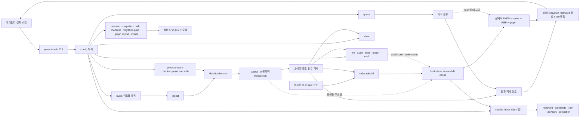

# Project Brain 전체 지도·데이터 계약 기반 설계

**상태:** 대화 설계 승인됨 · 독립 검토 READY · 구현 계획 READY · 구현 중
**작성일:** 2026-08-04
**대상 저장소:** Project Brain 엔진
**기준 HEAD:** `76827c3fe3e09104e657db515e0b21a37eb55b18`

## 1. 목적

새 에이전트가 오래된 계획 한 장이나 코드 일부만 보고 전체 동작을 추측하지 않도록,
Project Brain의 현재 구조를 다음 네 축으로 연결한다.

1. 엔진·데이터 2-레포 경계와 end-to-end 런타임 흐름
2. 기능 변경에서 코드·테스트·실코퍼스 검증까지 가는 작업 라우팅
3. 19개 객체 kind의 저장·신규 쓰기 계약과 검증되는 JSON 템플릿
4. 문서 권위·드리프트 점검·문맥 없는 새 에이전트 리허설

이 지도는 코드보다 높은 새 정본이 아니다. 의도는 설계 정본으로, 현재 동작은 코드·테스트·CLI로
되돌아갈 수 있게 하는 **검증된 탐색면**이다.

## 2. 문제 정의

현재 문서는 역할별로 흩어져 있다.

- `docs/design-canonical.md`: 정체성·철학과 일부 상세 복구 계약
- `README.md`: 설치·사용법
- `ROADMAP.md`: 현재 상태와 긴 완료 이력
- `docs/search-internals.md`: 검색층 상세
- `docs/specs/`, `docs/plans/`, `docs/reports/`: 결정과 역사
- `src/project_brain/templates/ingest/references/`: 설치되는 적재 안내

그러나 한 기능을 기준으로 `왜 → 현재 코드 → 입력·출력 → 검증 → 과거 결정`을 잇는 입구가 없다.
특히 저장 호환 스키마와 신규 쓰기 계약은 `schema → assembly → ingest → mutation → audit`에
나뉘어 있어 `KIND_REQUIRED`만 읽으면 CodeLocator quote 관문 같은 현재 동작을 오판한다.

기존 `object-model.md`는 주요 kind 표를 제공하지만 19종 전체와 조건부·금지 필드를 다루지 않는다.
`worked-example.md`는 실제 JSON이나 연결된 객체 그래프가 없다. 따라서 테스트가 초록이어도
에이전트가 어떤 값을 직접 채우고 무엇을 엔진이 생성하는지 알기 어렵다.

## 3. 권위 모델

### 3.1 의도

1. 최신의 명시적 사용자 결정과 정정
2. 사용자 발언 원장
3. `docs/design-canonical.md`의 검증된 정체성·철학·경계
4. 날짜가 붙은 설계·계획·보고서
5. 외부 아이디어와 vault 연구

### 3.2 현재 동작

1. 현재 checkout의 코드·테스트·CLI 실행 결과
2. `docs/architecture/` 지도에서 연결한 코드·테스트 경로
3. `ROADMAP.md` 상태 표기
4. 과거 spec·plan의 당시 설명

지도와 날짜 문서가 코드·테스트와 다르면 현재 동작은 코드·테스트가 이긴다. 단 코드가 사용자 의도나
정본 경계와 충돌하면 문서를 조용히 코드에 맞추지 않고 별도 gap으로 보고한다.

### 3.3 계보

계보는 현재 동작의 권위가 아니다. 이미 확보된 명시적 근거만 다음 중 하나로 짧게 분류한다.

- `초기 참고`: 조사·비교했으나 현재 채택 근거 없음
- `설계 반영`: 원칙이 정식 설계에 반영됨
- `구현 적용`: 코드·테스트·커밋에 명시적 적용 흔적이 있음
- `내부 진화`: 사용자 요구나 실코퍼스 측정으로 독립 개발됨
- `보류·기각`: 검토했으나 현재 구현에 넣지 않음

추가 외부 리서치나 발표용 서사는 하지 않는다.

## 4. 문서 구조

### 4.1 `docs/architecture/README.md` — 유일한 지도 진입점

다음을 한 화면에서 제공한다.

- 프로젝트 목적과 에이전트 소비 모델
- 엔진/데이터 2-레포 경계
- 전체 런타임 흐름도
- 문서 권위 모델
- 사용자 시나리오별 다음 문서
- 작업 종류별 첫 진입점

기존 문서 내용을 복제하지 않고 해당 절과 코드 심볼로 연결한다.

### 4.2 `docs/architecture/runtime-map.md` — 실행·데이터 흐름

다음 경로를 각각 입력, 출력, 코드 모듈, 불변식, 점검 명령으로 기록한다.

1. `build → ingest → MutationService → corpus_io → objects`
2. `promote/promote-auto/mark-checked/projection write/context-replace/migration → MutationService`
3. `objects + raw → index rebuild → local index`
4. `query → 의도 분류 → 정확 객체 경로 → 선택적 recall 보강 → 상태·redaction 제한 라벨 → answer`
5. fresh index가 필수인 `search`와 reviewed/candidate/raw/advisory/projection 다섯 채널
6. `show`, `projection_reuse`의 별도 소비 경로
7. `lint`, `audit`, `stale-check`, `graph`, `eval`, `doctor`
8. `session`, `snapshot`, `bootstrap`, installer와 설치되는 query/ingest/session-ingest/audit skill

최상위 명령은 `build`, `query`, `ingest`, `index`, `session`, `search`, `show`, `eval`,
`lint`, `audit`, `promote-auto`, `promote`, `install`, `doctor`, `bootstrap`, `projection`,
`graph`, `stale-check`, `mark-checked`, `snapshot`, `context-replace`, `migration`을 빠짐없이
분류한다. 하위 명령도 `index rebuild`, `session list/mark-processed`,
`projection build-reuse/refresh`, `graph isolated/export`, `snapshot create/verify/restore`,
`context-replace plan/apply`, `migration id/display/canonical-repair plan/apply`까지 기록한다.
첫 인자가 알려진 명령이 아니면 기존 bare query로 처리하는 호환 경로도 별도로 표시한다.

지도는 다음 핵심 경계를 명시한다.

- `build`는 저장하지 않는다.
- **코퍼스 객체 변경**은 `MutationService → corpus_io`를 거친다.
- raw, 객체 코퍼스, index, stale cache는 서로 다른 권위와 수명을 갖는다.
- 코퍼스 mutation은 파생 index와 stale cache를 무효화하지만 자동 rebuild하지 않는다.
- index DB, stale cache, session 처리 marker, build/context-replace/migration manifest,
  snapshot, graph export, installer 파일은 코퍼스 객체가 아닌 별도 산출물이다. 각 쓰기 주체와
  복구·멱등 경계를 따로 표시한다.
- reviewed, candidate, raw, advisory, projection 채널은 분리된다.
- graph·lint·reference rewrite는 `reference_fields.py` registry를 공유한다.
- `audit`는 stale cache를 쓸 수 있으므로 순수 read-only라고 부르지 않는다.

### 4.3 `docs/architecture/data-contracts.md` — 객체·관계·쓰기 관문

`schema.py`의 19개 kind 전부를 다룬다. 각 kind 행은 다음 항목을 갖는다.

- 공통 필드 외 필수 필드
- 조건부 필드와 상태별 추가 계약
- 금지·legacy 허용 필드
- 주요 enum과 값 형식
- 정상 생성 경로: build / promote / projection / direct-extra-object / migration 등
- 필드 작성 주체: 적재 에이전트 / build / write verifier / 엔진
- 다른 객체에 대한 참조와 cardinality
- 검색·라우터·audit·stale·graph·migration 소비처
- legacy 읽기 허용과 신규·좌표변경 쓰기 강제의 차이

문서는 `BASE_REQUIRED`·`KIND_REQUIRED`를 복사한 표에 그치지 않는다. imperative validation과
write gate까지 한 계약표로 합친다.

CodeLocator의 비대칭은 “legacy는 대충 허용”으로 일반화하지 않고 다음 순서로 정확히 적는다.

1. 최종 schema/lint 객체에는 `verified_at`가 필요하다.
2. mutation 입력 precheck에서만 verifier가 채울 `verified_at` 누락을 임시 허용한다.
3. 신규·좌표 변경·`mark-checked`는 repo context와 `verified_quote`를 요구하고 실제
   commit/path/symbol/quote를 검증한다.
4. 좌표가 바뀌지 않은 기존 locator는 과거 quote 누락을 그대로 보존할 수 있다.
5. structured ID 문제 보존은 동일 객체·동일 문제·동일 content hash에 한정되고,
   ID-only migration은 종료 시 보존 문제 0개를 요구한다.

이는 일반 schema 위반 전체를 legacy로 받아들이는 정책이 아니다.

### 4.4 `docs/architecture/change-map.md` — 변경·검증 라우팅

subsystem별로 다음을 연결한다.

- 수정할 production 파일
- 직접 unit/integration test
- 설치 ingest runtime test
- 데이터 레포 `brain/checks` 필요 여부
- `eval` 필요 여부
- 실모델 `index rebuild`가 필요한 정확한 조건
- 함께 확인해야 하는 횡단 계약

색인 입력·tokenizer·embedder·surface·raw chunk·index schema가 바뀔 때만 실모델 rebuild를 요구한다.
router·gate·ranking만 바뀌고 색인 입력이 같으면 rebuild는 생략할 수 있지만 checks와 eval은 요구한다.

### 4.5 기존 문서 역할 정리

- `docs/design-canonical.md`: 정체성·철학·안정적인 아키텍처 경계·미결만 유지
- `ROADMAP.md`: 현재 상태·완료 히스토리·미뤄둔 작업
- `README.md`: 설치·사용법
- `docs/search-internals.md`: 검색층 상세
- 날짜 spec/plan/report: 당시 결정과 증거

`design-canonical.md`의 Task 17 상세는 이번 구현에서 바로 축약하지 않는다. 후속 문서 정리의
선행조건은 전용 spec의 상태를 현재 구현·실코퍼스 적용 상태에 맞게 정정하고, 정본의 문단별 보존
위치를 대조표로 만드는 것이다. 그 전에는 현재 상세를 그대로 보존한다.

`README.md`와 `ROADMAP.md`에는 새 지도 진입 링크를 추가한다. 동일한 흐름·표는 복제하지 않는다.
단 README의 “점검·진단 4종 모두 읽기 전용” 문구는 옵션별 효과와 맞지 않으므로 이번
`DOC_DRIFT` 범위에서 함께 바로잡는다. `stale-check`는 기본만 읽기 전용이고 `--write-cache`가
로컬 cache를 쓰며, `doctor --download`는 모델 cache를 채운다. README에 빠진 `audit`도 명령
목록에 추가하고, 기본 실행이 stale-set cache를 쓰며 `--no-stale`일 때 생략한다는 점을 적는다.

## 5. 전체 런타임 그림



실제 문서에서는 이 한 장을 명령 표와 함께 읽게 한다. 특히 `query`는 DB가 없거나 stale이어도
정확 객체 경로와 안전 폴백으로 동작할 수 있지만, `search`는 fresh index 없이는 실패한다.
`session mark-processed`처럼 코퍼스 밖 파일을 직접 쓰는 경로를 mutation 경로로 그리지 않는다.
현재 query의 restricted 표시는 `EvidenceManifest.redaction_status != approved`에 따른 신뢰 라벨이지
principal별 ACL 집행이 아니다. QueryRouter에는 principal/ACL evaluator가 없고, audit CLI도 현재
둘을 `None`으로 호출한다. ACL 필드가 query 접근을 실제로 차단한다고 주장하지 않는다.

## 6. JSON 데이터 계약 산출물

JSON은 build 입력과 최종 저장 객체를 혼동하지 않게 두 층으로 나눈다.

```text
src/project_brain/templates/ingest/references/object-templates/
├── README.md
├── build-notes.complete.template.json
├── object-graph.complete.template.json
├── kinds/
│   └── <19개 Kind>.template.json
└── invalid/
    ├── manifest.json
    ├── notes-missing-context-commit.json
    ├── missing-base-required.json
    ├── missing-kind-required.json
    ├── candidate-without-metadata.json
    ├── reviewed-without-evidence.json
    ├── invalid-redaction-status.json
    ├── dangling-reference.json
    ├── code-locator-without-quote.json
    ├── code-locator-coordinate-change-without-quote.json
    └── reviewed-to-candidate.json
```

### 6.1 종류별 shape template

- 파일 집합은 `VALID_KINDS`와 정확히 같아야 한다.
- 공통·kind 필수 키를 모두 포함한다.
- 값은 허용 enum과 canonical ID grammar를 따른다.
- 독립 파일은 **필드 shape 참고용**이며 단독 ingest 가능하다고 주장하지 않는다.
- 참조가 필요한 kind는 대상 ID와 기대 kind를 명시한다.
- 설치기가 네 예약값 외 `{{...}}`를 치환하지 않으므로 임의 placeholder를 넣지 않는다.
- canonical ID와 schema를 만족하는 고정 합성값을 사용하고, README에 복사 뒤 바꿔야 할 필드와
  함께 바꿔야 하는 ID 결속 필드를 설명한다.

### 6.2 build 입력 template

`context`, `sources`, `code_anchors`, `glossary`, `mappings`, `decisions`, `refs`, `updates`,
`extra_objects`의 정상 형태를 포함한다. 일반 조립 section과 `extra_objects[]`의 경계를 먼저
구분한다. 일반 section은 build가 객체로 조립하지만, `extra_objects[]`는 ID·truth_role·timestamp까지
완성된 저장 객체 모양을 그대로 받는 직접 입력 탈출구다.

필드 책임은 다음처럼 실제 동작으로 한정한다.

- 적재자가 직접 정하는 의미·상태·경계
- 일반 section에서 build가 파생하는 ID·truth_role·timestamp
- `decisions[].affects`에서 `DomainMapping.decision_record_ids`로 역채우는 정확한 관계
- write verifier가 실제 repo에서 확정하는 full commit SHA·symbol·quote

“build가 모든 양방향 link를 파생한다”거나 “모든 입력 ID를 생성한다”고 일반화하지 않는다.

### 6.3 정상 객체 그래프

`object-graph.complete.template.json` 최상위 구조는
`{"schema_version": 1, "name": "core-ingest-graph", "objects": [...]}`로 고정한다.
`kinds/*.template.json`은 객체 하나가 최상위인 저장 객체 shape이고,
`build-notes.complete.template.json`은 `validate_notes()`에 직접 넘기는 notes object다.

최소한 다음 연결을 한 묶음에서 보여준다.

```text
EvidenceRef --evidence_manifest_id--> EvidenceManifest
DomainMapping --context_id--> DomainContext
DomainMapping --glossary_term_ids--> GlossaryTerm
DomainMapping --evidence_refs--> EvidenceRef
DomainMapping --decision_record_ids--> DecisionRecord
DecisionRecord --affected_mapping_ids--> DomainMapping
DecisionRecord --affected_context_ids--> DomainContext
DecisionRecord --source_object_ids/evidence_refs--> EvidenceRef
```

이 정상 bundle은 EvidenceManifest, EvidenceRef, DomainContext, GlossaryTerm, DomainMapping,
DecisionRecord 여섯 reviewed 객체를 하나의 연결 요소로 만든다. 실제 canonical reference
registry와 lint를 통과하고, 핵심 필드별 대상 kind도 테스트가 별도로 확인한다. `lint`가 현재
존재 여부만 검사한다고 해서 엉뚱한 kind 참조를 정상으로 취급하지 않는다.

CodeLocator는 신규 write에 실제 git repo·full SHA·symbol·quote 검증이 필요하므로 이 최소 그래프에
가짜로 섞지 않는다. 별도 정상 mutation fixture에서 EvidenceRef의
`locator.code_locator_id`와 DomainMapping의 `code_locator_ids` 연결까지 검증한다. ReviewRecord도
promotion 전용 fixture로 `target_object_id(s)`와 promoted target의 `review_record_id`를 검증한다.
19종 전부를 억지로 한 그래프에 연결하지 않고, 각 kind shape template과 핵심 그래프·전용
write fixture가 함께 전체 범위를 덮는다.

### 6.4 의도적 실패 반례

각 반례는 다음 metadata를 companion manifest에 갖는다.

- 실패해야 하는 층: notes / schema / lint / mutation
- 기대 오류 코드 또는 안정적인 메시지 조각
- 해당 반례가 막는 과거 오판·누락 유형

`invalid/manifest.json`의 최상위는 `{"schema_version": 1, "cases": [...]}`로 고정한다.
각 case는 `name`, `file`, `layer`, `validator`, `setup`, `expected`, `purpose`를 갖는다.
`layer`/`validator` 허용값은 각각 `notes|schema|lint|mutation`과
`validate_notes|validate_object|lint_store_report|mutation_plan`이다. `setup`은
`{"mode": <enum>, "base_fixture_files": [...]}` object이며 mode 허용값은
`standalone|merged_store|existing_object|repo_fixture`다. `expected`는
`{"code": <string|null>, "message_fragment": <string|null>}`이며 notes/schema 층은
`message_fragment`를, lint/mutation 층은 `code`를 반드시 지정한다. 둘 다 확인할 수 있으면
둘 다 지정한다. 코드가 없는 validator에 테스트 전용 가짜 코드를 만들지 않는다.
단일 객체만으로 재현할 수 없는 downgrade·dangling·write gate를 “나쁜 JSON 한 장”으로
축약하지 않는다.

`candidate-without-metadata`는 candidate GlossaryTerm, `reviewed-without-evidence`는 reviewed
GlossaryTerm으로 kind를 고정한다. CodeLocator는 신규 quote 누락과 좌표 변경 뒤 quote 누락을
분리하고, stable mutation error code를 확인한다.

반례가 통과하면 테스트가 실패해야 한다.

## 7. 자동 드리프트 방지

### 7.1 객체 계약 테스트

`tests/test_object_contract_templates.py`가 source 정본 JSON을 직접 읽는다.

- 파일명 kind 집합 = `VALID_KINDS`
- 종류별 template의 키 ⊇ `BASE_REQUIRED + KIND_REQUIRED[kind]`
- 종류별 고정 합성 template은 placeholder 없이 `validate_object()` 통과
- 정상 그래프는 ID 중복이 없고, 등록 참조를 무방향으로 보았을 때 단일 연결 요소이며,
  핵심 필드별 대상 kind가 맞고, `BrainStore` + `lint_store_report()` 결과가 비어 있음
- build notes는 `validate_notes()`와 `build()` 통과
- 신규·좌표 변경 CodeLocator 반례는 schema/legacy 읽기 호환 여부와 별개로 mutation의
  `quote_required`에서 실패
- 상태·근거·dangling 반례는 약속한 층에서 실패
- 동일 legacy CodeLocator는 `BrainStore.load()`와 읽기 경로에서 유지될 수 있지만 신규 생성이나
  좌표 변경 mutation에는 통과할 수 없다는 짝 테스트를 둔다. 축약 commit SHA는 structured-ID
  보존과 섞지 않고, 기존 좌표가 그대로인 legacy locator는 유지 가능하지만 신규·좌표 변경
  쓰기는 exact SHA gate에서 실패하는 별도 짝 테스트로 검증한다.

테스트 fixture와 설치 문서가 다른 사본이 되지 않도록, 테스트가
`src/project_brain/templates/ingest/references/object-templates/` 원본을 직접 소비한다.

`tests/test_installer.py`는 source 계약을 재검증하지 않고 실제 임시 설치 결과에서 19종 kind 파일,
정상 그래프, build notes, invalid manifest·case 경로가 존재하고 JSON 파싱되는지 확인한다. 같은
대상에 두 번 설치한 두 번째 report의 `created/updated/removed/adopted/skipped`는 모두 빈 배열이어야
한다.

### 7.2 지도 드리프트 테스트

`tests/test_architecture_docs.py`가 다음만 기계적으로 확인한다.

- 필수 지도 파일과 섹션 존재
- 지도에 선언한 source/test/doc 경로 존재
- `cli.main()`의 전체 최상위 명령 집합과 argparse 하위 명령 집합이 지도에 선언한 machine-readable
  표와 정확히 일치
- `MutationOperation` 전체 집합이 runtime/change map의 코퍼스 mutation 표와 정확히 일치
- 2-레포 경계와 명시 인자 우선 원칙이 지도에 존재
- 살아 있는 지도 문서에 과거 테스트 통과 개수를 현재 정본처럼 고정하지 않음

문서 문장을 코드에서 자동 생성하지 않는다. 경로·집합·필수 구조처럼 기계적으로 확정 가능한 것만 막는다.

## 8. AGENTS 작업 라우팅

`AGENTS.md`에는 세부 계약을 복제하지 않고 다음 진입표를 추가한다.

| 작업 | 먼저 읽을 곳 |
|---|---|
| 전체 구조·데이터 흐름 | `docs/architecture/README.md` |
| 적재 객체·필드·관계 | `docs/architecture/data-contracts.md` + JSON templates |
| 검색·라우터 변경 | `docs/architecture/change-map.md` 검색 행 + `docs/search-internals.md` |
| mutation·migration 변경 | runtime-map write path + change-map |
| 의도·설계 경계 | `docs/design-canonical.md` |
| 현재 완료·미뤄둔 일 | `ROADMAP.md` |
| 과거 이유 | 연결된 spec/plan/report |

에이전트는 날짜 plan을 현재 동작 근거로 단독 사용하지 않고 코드·테스트를 대조해야 한다.

## 9. 문맥 없는 새 에이전트 리허설

fork context 없이 새 에이전트에게 `AGENTS.md`와 저장소만 주고 다음 세 시나리오를 수행시킨다.

1. 질문이 답으로 만들어지는 end-to-end 경로와 관련 코드·테스트를 찾는다.
2. tokenizer 변경 시 수정 파일, 엔진 테스트, 데이터 checks/eval, rebuild 필요 여부를 판단한다.
3. CodeLocator 필드 누락 문제에서 legacy 읽기와 신규 쓰기 관문을 분리하고 정상 JSON을 찾는다.

PASS 기준:

- 엔진/데이터 2-레포 경계를 혼동하지 않는다.
- 오래된 plan을 현재 동작 정본으로 쓰지 않는다.
- `build`가 직접 저장한다고 말하지 않는다.
- `KIND_REQUIRED`만 보고 신규 write contract를 단정하지 않는다.
- 각 답에 현재 production 코드와 직접 테스트 경로를 제시한다.
- rebuild가 필요한 조건을 과잉·과소 판단하지 않는다.

결과는 `docs/reports/2026-08-04-project-brain-architecture-foundation.md`에 질문, 답, 판정,
남은 gap으로 기록한다. 보고서에는 현재 코드로 만든 정답표, 실제 프롬프트, fork context가 없었다는
실행 증거, 답변자와 별도의 독립 판정자를 남긴다. 한 시나리오라도 실패하면 문서를 보강하고 새
cold run을 반복한다. 세 시나리오가 모두 PASS하기 전에는 이번 목표를 완료로 표시할 수 없으며,
더 진행할 수 없는 외부 blocker가 생기면 완료가 아니라 blocked로 끝낸다.

## 10. 발견 gap 처리

지도 작성 중 새 결함이 보이면 다음으로 분류한다.

- `DOC_DRIFT`: 현재 코드는 명확하고 문서만 틀림 — 이번 범위에서 수정
- `TEMPLATE_GAP`: 정상·실패 예시나 자동 점검이 없음 — 이번 범위에서 수정
- `ENGINE_GAP`: 공식 쓰기·읽기 경로에 실제 동작 구멍 — 재현과 영향만 보고, 별도 승인 전 수정 금지
- `LEGACY_DEBT`: 기존 실코퍼스 데이터 누락·불일치 — 수와 원인만 기존 근거로 연결, 데이터 수정 금지
- `HISTORICAL_ONLY`: 과거 계획·실험에만 해당 — 역사로 보존

테스트가 없다는 이유만으로 엔진 동작을 바꾸지 않는다. 실제 공식 경로의 빈틈이 재현될 때만
ENGINE_GAP으로 올린다.

이번 설계 검토에서 이미 드러난 다음 항목은 문서가 현재 강제되는 것처럼 쓰지 않는다.

- registry 참조는 대부분 대상 kind까지 강제하지 않는다. 정상 예시 테스트만 기대 kind를 확인한다.
- `SpecRevision.slide_refs`와 `SlackThread.message_refs`는 현재 reference registry 밖이다.
- `KnowledgePage`, `IndexRecord`, `SpecDocument`, `SpecRevision`, `SlideRef`, `SlackThread`는 전용
  creator나 검색 surface가 없고 direct-extra-object/storage 중심이다.
- `ContextProjection.source_object_ids`는 schema상 빈 목록이 가능하지만 공식 생성기는 하나 이상을
  전제한다.
- QueryRouter는 redaction 상태 기반 restricted 라벨만 계산하고 principal별 ACL을 집행하지 않는다.
  ACL 필드의 실제 query 접근 제어는 현재 구현 계약이 아니며 별도 보안 설계가 필요한 `ENGINE_GAP`이다.

이들은 이번 문서에서 현재 동작과 불확실성으로 분리해 기록한다. 실제 typed-edge·schema·surface
동작을 추가하는 일은 `ENGINE_GAP` 후속 설계이지 이번 구현 범위가 아니다.

## 11. 범위 밖

- Task 18 표시 이름·quote backlog 실행
- BB2 또는 다른 소비 프로젝트의 실데이터 변경
- 실코퍼스 부채 일괄 수정
- 새 검색 알고리즘·reranker·MCP·UI
- 발표 자료·슬라이드
- 추가 외부 시스템 리서치
- 커밋·push·PR

## 12. 검증

구현 전 기준선은 isolated worktree에서 다음으로 확인한다.

- 엔진 pytest 전체
- 설치 ingest runtime unittest 전체

완료 시 다음을 새로 실행한다.

```bash
PYTHONPATH="$PWD/src" .venv/bin/python -m pytest -q
PYTHONPATH="$PWD/src" .venv/bin/python -m unittest discover \
  -s src/project_brain/templates/ingest/scripts -p 'test_*.py'
git diff --check
```

문서·template·test만 바꾸고 검색/색인/라우터 동작을 바꾸지 않으므로 실모델 rebuild는 하지 않는다.
단 조사 중 production 검색 계약을 수정해야 하는 blocker가 발견되면 멈추고 별도 범위를 요청한다.

installer가 references 전체를 배포하므로 `tests/test_installer.py`와 두 번 설치 no-op도 표적 검증한다.

## 13. 완료 기준

- [ ] `docs/architecture/` 네 문서가 서로 중복 없이 전체 경로를 연결한다.
- [ ] 19개 kind template 집합이 현재 `VALID_KINDS`와 일치한다.
- [ ] build 입력과 최종 객체 JSON이 분리돼 있다.
- [ ] 정상 핵심 객체 그래프와 각 층의 실패 반례가 자동 검증된다.
- [ ] legacy 읽기와 신규 쓰기 계약이 명시적으로 분리된다.
- [ ] AGENTS/README/ROADMAP에서 전체 지도 진입 경로를 찾을 수 있다.
- [ ] design-canonical의 Task 17 상세는 전용 spec 상태·문단 대조가 끝나기 전까지 보존된다.
- [ ] 문서·kind·경로·CLI 드리프트 테스트가 red→green으로 추가된다.
- [ ] cold-agent 리허설 세 시나리오가 모두 PASS하고 독립 판정 증거가 남는다.
- [ ] 별도 엔진 gap과 legacy debt는 임의 수정 없이 보고된다.
- [ ] 전체 엔진 테스트와 설치 runtime 테스트가 fresh run에서 통과한다.
- [ ] 기존 사용자 미추적 파일과 소비 프로젝트 데이터가 바뀌지 않는다.
