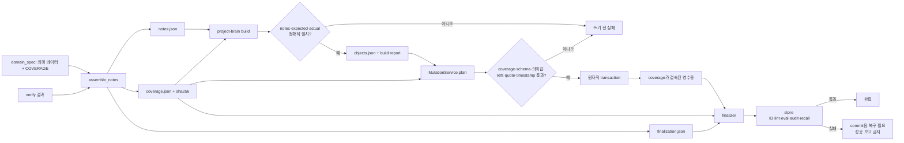

# Project Brain P0 적재 무결성·히스토리 시간 소유권 설계

**상태:** 대화 설계 승인됨 · 작성본 사용자 검토 대기
**작성일:** 2026-08-05
**대상 저장소:** Project Brain 엔진 + 설치되는 ingest runtime
**기준 엔진 HEAD:** `3f95bb06cecd21bf13248f0b6b54d0ee146bbe85`
**후속 작업:** P0 완료 뒤 새 snapshot/binding에서 Task 18 재설계

## 1. 목적

Project Brain의 일반 에이전트 적재가 다음 상황을 성공으로 끝내지 못하게 한다.

1. 도메인 섹션이나 항목 하나가 통째로 빠졌다.
2. 필수 키는 있지만 실제 내용이 공백이다.
3. build가 선언한 입력을 객체로 모두 펼치지 못했다.
4. 에이전트가 `created_at`·`updated_at`을 임의 값이나 날짜 자정으로 고정했다.
5. `extra_objects`·직접 ingest 같은 경로가 표준 검사를 우회했다.
6. 적재 뒤 전체 객체 집합과 transaction 영수증이 다른데도 완료로 보고됐다.

핵심은 엔진이 도메인 사실을 대신 판단하는 것이 아니다. 에이전트가 **적재 전에 선언한 범위**와
notes, build 결과, 실제 저장 결과가 끝까지 정확히 같은지 기계적으로 증명하는 것이다.

## 2. 현재 상태와 확인된 구멍

현재 엔진에는 이미 강한 쓰기 관문이 있다.

- `schema.py`는 공통·kind별 필수 키와 enum을 검사한다.
- `assembly.validate_notes()`는 현재 존재하는 section 항목의 필수 키와 일부 중첩 구조를 검사한다.
- `MutationService.plan()`은 중복 ID, ID 문법, 상태 전이, 참조, merged lint, precondition,
  CodeLocator quote·symbol·commit을 검사하고 원자적 transaction을 계획한다.
- 설치 runtime의 finalizer는 transaction 영수증을 확인하고 index rebuild, lint, eval, audit,
  고립 객체, 미머지 앵커, recall 표본을 검사한다.

그러나 이 관문은 **주어진 객체가 맞는지**에는 강하고 **무엇이 통째로 주어지지 않았는지**에는
약하다.

- `assembly.py`는 `context` 외 section을 선택으로 받고, `context`에 key·commit만 있는 빈
  입력도 build 오류 없이 객체 0개가 될 수 있다.
- 설치 `assemble_notes.py`는 verify 결과에 그룹이 없으면 빈 배열로 흡수하고,
  `GROUP_ORDER`의 그룹이 실제 verify 결과에 없어도 건너뛴다.
- glossary·mapping·decision의 여러 주장 문자열은 키만 있으면 공백도 통과할 수 있다.
- `extra_objects[]`는 완성 객체를 그대로 더하며 조립 범위 선언과 결속돼 있지 않다.
- finalizer의 `recall_checks[].expected_object_ids`는 검색 회수 표본이다. 전체 적재 객체 목록이
  아니므로 누락 방지 계약으로 재사용할 수 없다.
- `MutationService`는 일반 객체의 lifecycle timestamp를 중앙에서 다시 정하지 않는다.
- 설치 `domain_spec.template.py`의 `NOW` 예시와 `context.now` 전달 경로가 고정 자정값을 계속
  허용한다.
- 수기 JSON 쓰기는 저장 API를 우회할 수 있다. 운영체제 수준에서 막지는 못하지만 표준 완료
  절차의 audit가 실패하면 작업 성공으로 인정하지 않아야 한다.

2026-08-05 실코퍼스 확인에서는 10,941개 객체 중 `created_at` 자정값이 10,082개,
`updated_at` 자정값이 9,937개였다. 정확한 옛 시각은 남아 있지 않다. 엔진 커밋 `e2786d4`도
caller 주입이 `T00:00` 누적 원인이었다고 기록했고, BB2 커밋 `638c59b462`는 당시 실제 생성
시각을 복원할 수 없다고 명시했다. 따라서 옛 값을 현재 시각이나 Git 시각으로 덮는 것은 복구가
아니라 역사 날조다.

## 3. 범위

### 3.1 이번 P0에 포함

- 모든 notes section의 독립 범위 선언과 정확 비교
- 예상 build 객체 ID·kind와 실제 결과의 정확 비교
- 일반 `INGEST` 요청과 coverage 해시의 결속
- 신규·변경 객체의 명백한 공백값과 timestamp 형식 검사
- 일반 쓰기의 `created_at`·`updated_at` 엔진 소유
- 검증·검토·출처 사건시각과 lifecycle 시각의 소유권 분리
- `extra_objects`와 objects-file ingest의 동일 관문 적용
- 설치 single/batch runner와 finalizer 영수증 확장
- kind별 JSON 템플릿과 실제 schema의 드리프트 테스트
- 기존 코퍼스에 대한 비파괴 진단
- P0 설치·audit 뒤 Task 18용 새 snapshot/binding을 만들기 위한 순서 정리

### 3.2 이번 P0에서 제외

- 선언조차 되지 않은 도메인 사실을 LLM이나 엔진이 추론해 보충하는 기능
- 수기 JSON 파일 저장을 운영체제나 Git hook으로 원천 봉쇄하는 기능
- 기존 자정 timestamp를 파일 mtime·Git commit 시각·현재 시각으로 추측 백필
- `ingested_at`, 별도 이벤트 원장, timestamp 정밀도 필드 추가
- 기존 quote 누락 전면 백필, title migration, 심볼 교정, EvidenceRef 짝 라벨 변경
- 검색·라우팅·랭킹 변경과 실모델 index rebuild
- 현재 사용자 dirty 파일 정리

## 4. 대안과 결정

### 4.1 사후 expected ID 검사만 추가 — 기각

finalizer에 전체 예상 ID를 넣으면 변경량은 작다. 하지만 이미 commit된 뒤에야 실패하고,
notes/build 단계의 누락과 직접 ingest 우회를 막지 못한다.

### 4.2 독립 coverage + 중앙 쓰기 정책 — 채택

적재 전에 범위를 선언하고 assemble, build, mutation, finalization까지 같은 해시를 전달한다.
`MutationService`는 작업 종류에 따라 lifecycle timestamp 정책을 고정한다. 기존 구조와 transaction
영수증을 재사용하면서 실제 구멍을 쓰기 전에 막을 수 있다.

### 4.3 전체 이벤트 원장 + 파일 쓰기 차단 — 보류

가장 강하지만 새 schema와 실코퍼스 migration, 별도 운영 저장소가 필요하다. 현재 문제를 푸는 데
필요한 범위를 넘는다.

## 5. 전체 구조



## 6. `CoverageContract`

### 6.1 선언 위치와 형태

조립 적재에서는 `domain_spec.py`의 `COVERAGE`가 사람·에이전트가 작성하는 독립 원본이다.
build 결과에서 역산하지 않는다. 다음은 `assembled` mode의 shape 예시다.

```python
COVERAGE = {
    "version": 1,
    "mode": "assembled",
    "verify_groups": {"names": ["race-mode"]},
    "context": {"key": "main-map", "mode": "create"},
    "sections": {
        "sources": {"ids": ["manifest.main-map.code"]},
        "glossary": {"keys": ["race-mode"]},
        "code_anchors": {"keys": ["select-race-mode"]},
        "mappings": {"keys": ["race-mode"]},
        "decisions": {
            "items": [],
            "empty_reason": "이번 입력에서 확인된 결정 근거 없음",
        },
        "refs": {
            "items": [],
            "empty_reason": "기존 객체 참조 없음",
        },
        "updates": {
            "ids": [],
            "empty_reason": "신규 적재",
        },
        "extra_objects": {
            "objects": [],
            "empty_reason": "직접 객체 입력 없음",
        },
    },
    "expected_objects": [
        {"id": "context.main-map", "kind": "DomainContext"},
        {"id": "manifest.main-map.code", "kind": "EvidenceManifest"},
        {"id": "code.main-map.select-race-mode", "kind": "CodeLocator"},
        {"id": "evref.main-map.select-race-mode", "kind": "EvidenceRef"},
        {"id": "g.main-map.race-mode", "kind": "GlossaryTerm"},
        {"id": "mapping.main-map.race-mode", "kind": "DomainMapping"},
    ],
}
```

출력 ID 계산에 필요한 identity는 단순 key보다 구체적으로 선언한다.

- `decisions.items[]`: `key`와 EvidenceRef를 만드는 `evidence[{type, ref}]`
- `refs.items[]`: 실제 중첩 위치를 보존하는 `category`, `alias`, `id`, `expect`. 현재 resolver가
  category를 버리고 alias로 조회하므로 alias는 모든 category를 통틀어 전역 유일해야 함
- `extra_objects.objects[]`: `id`, `kind`
- `verify_groups.names[]`: verify 결과에 반드시 존재해야 하는 group 이름

각 raw list의 중복은 set으로 접기 전에 실패한다. decision evidence는 `(type, ref)`, refs는
전역 `alias`, 모든 최종 객체는 `(id, kind)`를 identity로 사용한다. 서로 다른 refs category에서
같은 alias를 써도 resolver의 조용한 덮어쓰기를 막기 위해 실패한다.
verify group을 쓰지 않는 assembled 입력은 `names: []`와 공백이 아닌 `empty_reason`을 함께
선언한다. `verify_groups.names`의 순서가 곧 조립 순서이며 기존 `GROUP_ORDER`를 대체한다. raw verify
결과의 group 집합이 더 적거나 많아도 실패해 조용히 건너뛰는 group을 없앤다.

objects-file 직접 적재는 domain spec이 없으므로 별도 `direct` mode coverage JSON을 작성한다.

```json
{
  "version": 1,
  "mode": "direct",
  "objects": [
    {"id": "ledger.main-map.example", "kind": "EventLedgerRecord"}
  ]
}
```

두 mode는 필드를 섞지 않는다. `assembled`는 verify/context/sections/expected_objects가 필요하고,
`direct`는 objects만 필요하다. direct objects 목록 자체가 expected objects다.

`context.mode`는 다음 둘뿐이다.

- `create`: 같은 ID가 store에 없어야 하고 notes가 `DomainContext` 하나를 만들어야 한다. 이미
  있으면 `updates` 또는 `reuse`를 쓰도록 실패한다.
- `reuse`: 같은 ID의 `DomainContext`가 store에 존재해야 하고 context 객체를 만들지 않는다.

모든 notes section을 선언한다. 승인 대화의 최소 목록에 더해 `context`와 `refs`도 포함하는 이유는
둘 다 실제 notes 입력이며, 빠졌을 때 연결 결과가 달라질 수 있기 때문이다. 목록이 비었으면 공백이
아닌 `empty_reason`이 필요하고, 목록이 있으면 `empty_reason`을 허용하지 않는다. ID·key는 비어
있지 않고 중복될 수 없다.

`expected_objects`는 최종적으로 생겨야 하는 `(id, kind)`의 중복 없는 전체 목록이다. section
선언만 맞고 확장 규칙이 잘못되는 경우까지 잡기 위해 assembled coverage에 함께 고정한다.

### 6.2 세 가지 집합

coverage는 서로 다른 세 집합을 관리한다.

1. **선언 입력 집합**: section별 ID·key
2. **notes 실제 집합**: 조립 결과에서 읽은 ID·key
3. **예상 객체 집합**: 선언을 기계적으로 펼친 최종 객체 ID·kind

예상 객체는 build 결과에서 만들지 않고 독립 planner가 ID 문법과 section 확장 규칙으로 계산한 뒤,
`COVERAGE.expected_objects`와 먼저 정확히 비교한다. 두 값이 다르면 build에 들어가지 않는다.
예를 들어 code anchor 하나는 `CodeLocator`와 `EvidenceRef` 두 개, source 하나는
`EvidenceManifest` 하나가 되어야 한다. decision의 근거 EvidenceRef는 중복 제거 규칙까지 같은
입력 선언에서 계산한다. 이 계산기는 `assembly.build()`의 output을 호출하거나 읽지 않는 순수
planner다. `refs`는 기존 객체 연결 입력이므로 새 객체를 만들지 않는다.

`assemble_notes`는 선언 입력과 notes 실제 집합을 정확히 비교한다. `build`는 예상 객체 집합과
실제 output의 `(id, kind)`를 정확히 비교한다. 빠진 것뿐 아니라 선언하지 않은 추가 객체도
실패다. 일반 LIVE ingest의 예상 객체 집합은 비어 있을 수 없다.

### 6.3 전달과 결속

`assemble_notes.py`는 notes, finalization config와 함께 정규화된 `coverage.json`을 출력한다.
direct ingest는 사용자가 제공한 coverage JSON을 같은 parser로 정규화한다. 두 mode 모두 engine
정본 함수가 key 순서·배열 순서를 고정한 canonical JSON bytes와 SHA-256을 만든다.

- build report: canonical coverage 해시, 예상 `(id, kind)`, 실제 `(id, kind)`
- `MutationRequest`: canonical coverage 전체와 build artifact binding
- `MutationService`: coverage를 다시 정규화·해시하고 request object의 `(id, kind)`와 직접 비교
- mutation manifest·transaction receipt: 같은 coverage 해시, expected·verified·changed object
- finalizer: item별 expected와 verified `(id, kind)`를 정확히 비교
- batch binding: 기존 verify/domain spec 결속에 coverage 해시를 추가

일반 `MutationOperation.INGEST`는 coverage binding이 없으면 실패한다. `extra_objects`도 선언된
ID만 받을 수 있다. objects-file로 한 객체를 직접 적재할 때도 그 파일의 범위를 선언한 coverage가
필요하며 CLI는 `--coverage-file`을 받는다. hash와 expected ID만 caller가 자기신고하게 두지 않고,
MutationService가 canonical contract 전체에서 둘을 다시 계산한다. 반면 promote·mark-checked처럼
대상 ID가 명령 자체에 들어 있는 작업은 별도
`COVERAGE` 파일을 요구하지 않고 operation의 명시적 대상 집합을 범위로 사용한다.

일반 `INGEST`에는 `delete_ids`, `renames`, auxiliary file update를 허용하지 않는다. coverage가
after object만 선언하는데 숨은 삭제 action을 붙이는 우회를 닫기 위해서다. 삭제·이름 변경은
desired-state와 drop/move 집합을 별도로 exact 선언하는 `CONTEXT_REPLACE` 또는 등록된 migration
operation만 사용한다.

표준 `project-brain build` CLI도 coverage 파일을 필수로 받는다. low-level 테스트가 아닌 일반
CLI에 coverage 없는 호환 fallback이나 `--skip-coverage` 옵션을 두지 않는다. batch에서는 item별
expected ID가 겹치면 순서 의존 갱신으로 간주해 시작 전에 실패시키며, 순차 갱신은 `updates`가 있는
하나의 명시적 item으로 합친다. 각 item record는 자기 coverage SHA, expected, verified, changed를
보존하고 resume fingerprint에도 canonical coverage bytes를 넣는다. batch 전체 합집합 비교는 보조
요약일 뿐 item별 실패를 대신하지 않는다.

이 결속은 실수와 에이전트 workflow drift를 막는 무결성 경계이지 악의적인 caller에 대한 서명
체계가 아니다. 같은 caller가 원문 사실과 coverage를 함께 거짓으로 줄이는 문제는 이 계약만으로
증명할 수 없다.

### 6.4 보장하지 않는 것

에이전트가 원문에서 사실 하나를 발견하지 못해 `COVERAGE`에도 쓰지 않았다면 엔진이 그 사실을
알아낼 방법은 없다. coverage는 **선언과 산출의 완전성**을 보장한다. 원문 대비 의미 완전성은
verify, 사용자 검토, recall/eval 시나리오가 담당한다.

## 7. 신규·변경 쓰기의 최소 의미값 계약

기존 `validate_object()`를 곧바로 전수 강화하지 않는다. before/after를 아는 write 전용
validator를 둔다. 신규 객체는 전체 새 계약을 적용한다. 기존 객체에서는 새로 생기거나 값이 바뀐
문제만 실패시키고, 같은 object ID·같은 field·같은 값에 이미 있던 문제만 grandfather한다. 이는
현재 structured ID 문제 보존과 같은 방향이며, 관련 없는 필드를 고친다는 이유로 기존 부채가 전체
transaction을 막는 것을 피한다. PRESERVE operation은 각 작업의 exact-payload 검사가 허용한
기존 문제만 그대로 옮길 수 있다.

초기 규칙은 다음처럼 해석 여지가 없는 문자열에 한정한다.

- 공통: `id`, `kind`, `status`, `poc_priority`, `truth_role`, `title`, `created_at`, `updated_at`
- Evidence 계열: `source_type`, `captured_at`, `captured_by`, `sensitivity`,
  `redaction_status`, `ref_type`, `summary`
- 시간·검토 계열: `reviewer`, `reviewed_at`, `verdict`, `event_type`, `happened_at`, `summary`,
  `valid_from`
- 코드·도메인 계열: `repo`, `path`, `locator_source`, `verified_at`, `context_key`, `project_id`,
  `display_name`, `boundary_summary`, `term`, `definition`, `mapping_key`, `canonical_summary`,
  `meaning`, `boundary`
- 합성·문서 계열: `format`, `source_content_hash`, `projection_hash`, `generated_at`,
  `generated_by`, `stale_policy`, `view_type`, `as_of`, `category`, `source_system`,
  `canonical_locator`, `revision_label`, `channel_id`, `thread_ts`, `decision_type`, `decision`,
  `spec_reflected`, `body`

해당 필드가 그 kind의 필수 필드일 때 값은 문자열이어야 하고 `strip()` 뒤 비어 있지 않아야 한다.
list·dict의 내용까지 일괄 non-empty로 만들지는 않는다. 이미 kind별 schema가 강제하는 관계 수와
상태 규칙은 그대로 사용한다. `TBD`, `unknown` 같은 문구의 진실성도 이 validator가 판단하지
않는다.

## 8. timestamp 소유권

### 8.1 작업과 action으로 고정되는 정책

timestamp 정책은 CLI 플래그나 agent 입력이 아니다. operation과 검증된 action 종류로 정한다.

| 결과 | 작업·action | 의미 |
|---|---|---|
| `LIVE` | `INGEST`, `PROMOTE`, `PROMOTE_AUTO`, `MARK_CHECKED`, `PROJECTION` | 실제 생성·의미·상태 변경을 엔진 lifecycle 시각으로 기록 |
| `PRESERVE` | `PROJECTION_REPAIR`, `ID_ONLY_MIGRATION`, `DISPLAY_MIGRATION`, `CANONICAL_REPAIR` | exact-payload로 제한된 기술 repair/migration의 기존 시각 보존 |
| action별 판정 | `CONTEXT_REPLACE` | 신규·의미 변경은 LIVE, 증명된 move·참조 rewrite만 PRESERVE |

`CONTEXT_REPLACE`의 standalone create는 LIVE create, 같은 ID의 의미 변경은 LIVE update다.
`expected_moves`로 old→new가 결속되고 ID·등록 참조 외 의미 payload가 같은 move는 source의
`created_at`·`updated_at`을 승계한다. 외부 객체의 reference-only rewrite도 두 값을 보존한다.
delete에는 새 timestamp가 없다. 새로 만들거나 의미를 바꾸는 `ContextProjection`은 context replace로
허용하지 않고 전용 `PROJECTION` operation을 사용한다.

새 operation을 추가할 때 모든 action의 정책을 명시하지 않으면 시작 시 실패한다. 범용
`--preserve-timestamps` 옵션은 만들지 않는다.

### 8.2 MutationService 처리 순서와 단일 clock

현재처럼 CLI, projection builder, verifier, mark-checked가 각자 `now_kst()`를 호출하지 않는다.
caller는 명시된 사건시각 또는 `None`이라는 intent를 보존해 `MutationService`에 넘기고, verifier와
generator는 시각을 자체 생성하지 않는다.

처리 순서를 다음으로 고정한다.

1. request·coverage shape와 operation-kind 조합 검사
2. store before-state 로드
3. **operation-aware pre-schema** 검사 — LIVE에서 엔진이 채울 lifecycle·검증·생성 시각 누락 허용
4. 시각을 쓰지 않는 operation transform과 CodeLocator 실제 검증
5. 엔진 소유 temporal field를 제외한 substantive before/after diff와 명시적 operation event 계산
6. substantive 변경 또는 operation event가 하나라도 있을 때만 transaction clock을 정확히 한 번 생성
7. LIVE stamp 또는 검증된 PRESERVE 정책 적용
8. 전체 필수 필드가 채워진 final schema·write semantic·merged lint 검사
9. manifest hash와 transaction 계획 생성

이 순서 덕분에 caller가 곧 버려질 가짜 `created_at`·`updated_at`·`verified_at`을 채울 필요가 없다.
성공한 `MARK_CHECKED` 검증은 좌표와 quote가 같아도 새 검증 사건이므로 operation event 하나를 만든다.
따라서 clock을 열어 `verified_at == updated_at`을 새로 기록한다. 그 밖의 no-op은 clock을 호출하지
않으며, `generated_at`이나 `verified_at`을 먼저 바꿔 가짜 변경을 만들지도 않는다. 테스트만
`MutationService(clock=lambda: FIXED_TIME)` 형태로 clock을 주입할 수 있고,
production CLI와 `domain_spec.py`는 주입할 수 없다.

### 8.3 lifecycle timestamp

- LIVE 신규 생성: caller 값과 관계없이 `created_at == updated_at == transaction clock`
- LIVE 기존 수정: 저장된 `created_at` 보존, substantive 변경이 있을 때만
  `updated_at = transaction clock`
- LIVE no-op: `created_at`·`updated_at` 모두 보존
- PRESERVE: operation별 exact-payload 검사가 확인한 source 값을 그대로 보존

기존 객체와 비교할 때 caller가 보낸 `created_at`·`updated_at` 차이는 substantive 변경으로 세지
않는다. 기존 문제가 있는 필드는 같은 object·field·value일 때만 grandfather한다.

### 8.4 kind별 시간 필드 정본

여기서 caller 소유란 사건의 실제성을 엔진이 증명한다는 뜻이 아니라 **caller가 선언한 시각을
형식 검사해 저장한다**는 뜻이다.

| 필드 | 적용 kind | 소유자·형식 |
|---|---|---|
| `created_at`, `updated_at` | 전체 | LIVE는 MutationService, PRESERVE는 검증된 source 값 |
| `captured_at` | EvidenceManifest, SpecRevision | caller-declared ISO-8601 + 명시적 timezone |
| `reviewed_at` | ReviewRecord | caller-declared ISO-8601 + timezone, promote 생략 시 transaction clock |
| `happened_at` | EventLedgerRecord | caller-declared ISO-8601 + timezone |
| `valid_from`, 선택 `valid_until` | TemporalFact | caller-declared ISO-8601 + timezone |
| `as_of` | CurrentView | caller-declared ISO-8601 + timezone |
| `indexed_at` | IndexRecord | caller-declared ISO-8601 + timezone. 현재 전용 index creator가 없어 엔진 실행 증거로 주장하지 않음 |
| `verified_at` | CodeLocator | 신규·좌표 변경·mark-checked 검증 성공 뒤 transaction clock |
| `generated_at` | ContextProjection | `PROJECTION` generator가 transaction clock 사용. 일반 INGEST 신규·의미 변경은 거부 |
| `thread_ts` | SlackThread | Slack 외부 식별자. ISO timestamp 검사를 적용하지 않음 |

사건시각과 `created_at`의 앞뒤 관계는 강제하지 않는다. 과거 사건을 오늘 적재할 수 있기 때문이다.
명시적 timezone이 없는 값과 실제 ISO-8601로 해석되지 않는 값은 신규 또는 해당 필드 변경에서
실패한다. 자정 자체는 정상 시각이다.

promote에서는 대상 객체의 `created_at`을 보존하고, 대상의 `updated_at` 및 새 ReviewRecord의
`created_at`·`updated_at`은 transaction clock을 사용한다. ReviewRecord의 `reviewed_at`만 caller가
선언한 검토 사건시각을 담고, 생략됐을 때 같은 transaction clock을 쓴다.

### 8.5 legacy와 진단

기존 lifecycle·사건시각 필드가 바뀌지 않으면 옛 형식도 같은 field value로 grandfather한다.
의미 수정으로 `updated_at`이 새로 기록되더라도 옛 `created_at`·`captured_at`이 바뀌지 않았다면
보존하고 진단만 남긴다.

audit 진단은 둘로 나눈다.

- `timestamp_format_legacy`: parse 실패·timezone 누락 같은 실제 형식 부채. hard error가 아닌 집계
- `midnight_density`: 날짜·context별 자정값 밀도 통계. 정상 자정도 포함할 수 있으므로 exit code에
  영향을 주지 않는 정보

기본 출력은 field·형식·날짜별 개수만 보여 주고 객체별 상세 목록은 별도 JSON 출력에서만 제공한다.
`NOW`와 production `context.now` 경로는 제거한다. build CLI의 lifecycle 필드는 engine clock으로
만든 검토용 값이고, 실제 ingest에서 transaction clock으로 최종 확정한다.

## 9. 오류 처리와 원자성

### 9.1 쓰기 전 실패

다음은 transaction을 시작하기 전에 non-zero로 끝난다.

- coverage 없음·shape 오류·빈 section 이유 누락
- 선언 입력과 notes 불일치
- expected와 build output 불일치
- coverage hash와 build report·request 불일치
- 신규 문제 또는 값이 바뀐 공백·timestamp 형식 오류
- 기존 schema·ID·참조·CodeLocator·precondition·merged lint 오류

오류는 적어도 `error_code`, section 또는 object ID, missing, unexpected, coverage SHA를 제공한다.
권장 오류 코드는 `coverage_required`, `coverage_invalid`, `coverage_notes_mismatch`,
`coverage_build_mismatch`, `coverage_binding_mismatch`, `write_semantics_invalid`,
`timestamp_invalid`다.

### 9.2 멱등 no-op

같은 coverage와 byte-equivalent 객체를 다시 넣는 것은 실패가 아니라 성공한 no-op이다. 다만
실제 변경 ID와 coverage 증명 ID를 섞지 않는다.

mutation 결과는 다음을 구분한다.

- `outcome`: `committed` 또는 `no_changes`
- `expected_objects`: canonical coverage의 `(id, kind)`
- `verified_objects`: request와 store에서 검증을 마친 `(id, kind)`
- `changed_objects`: 실제 create/update/delete/rename action
- `coverage_sha256`, `before_fingerprint`, `after_fingerprint`

`no_changes`는 `committed: false`, 빈 `changed_objects`, 같은 before/after fingerprint를 갖지만
`verified_objects == expected_objects`여야 한다. canonical 결과의 `receipt_id`를 만들고 single runner와
batch item record가 보존한다. finalizer는 `ingested_ids` 합집합이 아니라 item별
`verified_objects`를 coverage와 비교한다. 따라서 일부 객체만 no-op인 혼합 transaction과 전체
no-op 재실행이 모두 거짓 실패 없이 검증된다.

### 9.3 commit 뒤 실패

coverage와 결정론적 데이터 무결성 검사는 전부 commit 전에 끝낸다. search·eval·audit처럼 저장 뒤
상태를 봐야 하는 finalizer 검사에서 실패할 수는 있다. 이 경우 transaction을 자동 삭제하지 않는다.

- transaction receipt에는 `committed: true`가 남는다.
- workflow 결과는 `ok: false`, `recovery_required: true`다.
- 이후 같은 receipt로 finalizer를 다시 실행한다. 되돌려야 하면 별도 승인 뒤 신뢰 snapshot restore
  또는 정확한 역방향 mutation을 계획한다.
- 다음 batch item과 최종 성공 보고는 차단한다.

이미 commit된 데이터를 실패 처리 과정에서 자동 삭제하면 별도 실패로 원인을 가릴 수 있으므로
복구 선택은 분리한다.

### 9.4 수기 JSON

운영체제 수준의 쓰기는 막지 않는다. 대신 표준 agent 완료 경로는 기존처럼 lint와 audit를 반드시
실행한다. 수기 파일이 schema·enum·참조 계약을 어기면 finalizer가 실패한다. 적재가 끝난 뒤 다시
수기 변경한 경우에는 다음 audit 전까지 탐지할 수 없다는 한계를 문서에 명시한다.

## 10. 템플릿과 단일 원본

kind별 JSON 템플릿은 입력 예시와 회귀 fixture다. 필수 키의 단일 원본은 계속
`schema.py::BASE_REQUIRED`, `KIND_REQUIRED`와 imperative validator다.

테스트는 다음을 강제한다.

1. template kind 집합과 `VALID_KINDS`가 정확히 같다.
2. 모든 template이 schema·ID·쓰기 의미값 계약을 통과한다.
3. 공통·kind 필수 키를 하나씩 뺀 변형이 실패한다.
4. timestamp 예시는 명시적 timezone을 갖는다. 고정 자정값은 shape fixture일 뿐 실제 사건 증거로
   해석하지 않는다고 README에 표시한다.
5. `build-coverage.complete.template.json`과 `direct-coverage.template.json`이 두 mode를 각각
   검증 가능한 형태로 보여 준다.
6. build complete template과 assembled coverage template의 section·expected object가 일치한다.
7. 설치된 reference와 저장소 원본이 같다.

템플릿 안에 독립적인 필수 키 목록을 다시 만들지 않는다. schema 변경 뒤 template이 낡으면
테스트가 실패하게 한다.

## 11. 테스트 전략

구현은 TDD로 진행한다. 핵심 red 시나리오는 다음과 같다.

### 11.1 coverage

- verify에 선언한 그룹 하나가 없으면 assemble 실패
- section 전체 또는 항목 하나가 notes에서 빠지면 실패
- 빈 section에 `empty_reason`이 없거나, non-empty section에 이유가 있으면 실패
- raw list 중복이 set 비교 전에 실패
- 서로 다른 refs category의 같은 alias가 전역 중복으로 실패
- context `create/reuse`와 실제 DomainContext output이 다르면 실패
- code anchor 한 개가 CodeLocator 또는 EvidenceRef 하나만 만들면 실패
- unexpected object, duplicate ID, 잘못된 kind가 있으면 실패
- 객체 0개 LIVE ingest가 실패
- `extra_objects` 미선언 `(id, kind)`와 objects-file ingest의 direct coverage 없음이 실패
- caller가 canonical coverage bytes·SHA·expected를 서로 다르게 주면 MutationService가 실패
- 일반 INGEST의 delete·rename·auxiliary update가 operation gate에서 실패
- batch resume에서 domain spec·coverage SHA가 달라지면 실패
- batch item 사이 expected ID 중복이 시작 전에 실패
- item별 expected와 verified `(id, kind)`가 다르면 finalizer 실패
- 같은 payload 재실행은 `no_changes` receipt로 성공하고 clock·코퍼스를 건드리지 않음

### 11.2 의미값·시간

- 필수 주장 문자열이 공백인 신규 객체와 새로 생기거나 값이 바뀐 문제가 실패
- 같은 object·field·value의 legacy 문제는 관련 없는 필드 변경에도 보존되고 진단만 남음
- LIVE create가 caller timestamp를 덮고 `created_at == updated_at`
- LIVE update가 created를 보존하고 실제 변경 때만 updated를 갱신
- no-op이 lifecycle timestamp를 보존
- 한 transaction의 여러 객체가 같은 clock을 사용
- LIVE pre-schema는 엔진 소유 temporal field 누락을 허용하고 stamp 뒤 final schema는 누락을 거부
- `extra_objects`와 objects-file도 같은 시간 정책 적용
- 신규·변경 사건시각의 잘못된 ISO/timezone이 실패
- CodeLocator caller `verified_at`을 신뢰하지 않고 verifier clock을 사용
- mark-checked의 `verified_at == updated_at`
- 같은 commit·좌표를 다시 mark-checked해도 새 검증 operation event와 시각을 기록
- promote의 `reviewed_at`과 lifecycle 시간이 분리
- 각 PRESERVE operation이 timestamp를 byte-exact 보존
- context replace의 standalone create·의미 update는 LIVE, exact move·ref rewrite는 PRESERVE
- ContextProjection 신규·의미 변경은 PROJECTION 외 operation에서 실패
- `meaning` 변경과 무관한 옛 invalid `created_at`·`captured_at`은 값이 같으면 통과
- `thread_ts`는 ISO 검사에서 제외되고 `valid_until`·`as_of`·`indexed_at`은 caller-declared ISO 검사
- midnight density는 정보 집계일 뿐 audit exit code를 바꾸지 않음
- production CLI에서 fixed clock을 주입할 수 없음

### 11.3 전체 회귀

```bash
uv sync --extra mecab
.venv/bin/python -m pytest -q
.venv/bin/python -m unittest discover \
  -s src/project_brain/templates/ingest/scripts -p 'test_*.py'
```

설치기는 임시 대상에 두 번 설치해 두 번째 report의
`created/updated/removed/adopted/skipped`가 모두 빈 배열인지 확인한다.

BB2에는 새 runtime을 설치한 뒤 정확한 checkout을 지정해 다음을 실행한다.

```bash
cd /Users/al03040455/Desktop/bb2_client
PYTHONPATH=/Users/al03040455/Downloads/codes/project-brain/src \
  /Users/al03040455/Downloads/codes/project-brain/.venv/bin/python \
  -m unittest discover -s brain/checks -p 'test_*.py'

PYTHONPATH=/Users/al03040455/Downloads/codes/project-brain/src \
  /Users/al03040455/Downloads/codes/project-brain/.venv/bin/python \
  -m project_brain.cli lint

PYTHONPATH=/Users/al03040455/Downloads/codes/project-brain/src \
  /Users/al03040455/Downloads/codes/project-brain/.venv/bin/python \
  -m project_brain.cli audit --no-fetch

PYTHONPATH=/Users/al03040455/Downloads/codes/project-brain/src \
  /Users/al03040455/Downloads/codes/project-brain/.venv/bin/python \
  -m project_brain.cli eval
```

P0 배포 자체는 코퍼스 객체를 바꾸지 않고 검색 표면·색인 입력·embedder도 바꾸지 않으므로 별도
실모델 index rebuild를 하지 않는다. 이후 coverage를 통과한 실제 적재가 코퍼스를 바꾸면 기존
finalizer의 `index rebuild`는 그대로 실행한다.

### 11.4 비변이 P0 runtime gate

P0 설치 자체에는 ingest transaction이 없으므로 기존 finalizer를 억지로 호출하지 않는다. 설치되는
별도 `validate_foundation.py`가 비변이 검증을 수행하고 canonical JSON receipt를 출력한다.

BB2를 건드리기 직전에 baseline receipt를 먼저 만든다.

- 최종 P0 engine HEAD, tracked status, 기존 untracked path·content hash
- 실행 핵심 경로(`src/project_brain`, `pyproject.toml`, `uv.lock`)가 clean인지와 실제
  `project_brain.__file__`·CLI 진입점이 이 checkout을 가리키는지
- BB2 HEAD와 기존 사용자 dirty path·content hash
- `brain/objects` mutation fingerprint와 `brain/raw` content fingerprint
- search-index meta의 corpus fingerprint와 index DB file SHA-256을 구분한 값
- 설치 runtime managed-file manifest
- `.brain-local/stale-set.json` SHA-256

immutable 범위는 engine 실행 핵심 경로, `brain/objects`, `brain/raw`, 기존 사용자 dirty, index DB다.
engine의 기존 미추적 문서·deck은 허용 목록과 content hash로 보존하되, 실행 핵심 경로 아래의
미추적 파일은 허용하지 않는다. 설치기가 관리한다고 선언한 BB2 runtime 파일만 expected mutation이고,
audit가 쓰는 stale-set은 별도 expected-local-mutation으로 분리한다. 다른 path 변화는 gate 실패다.

foundation gate는 설치 1·2회차 report, 설치 runtime unittest, BB2 corpus checks, lint,
`audit --no-fetch`, 기존 index를 사용하는 eval, dry-run coverage smoke를 실행한다. ingest receipt가
없으므로 finalizer와 index rebuild는 호출하지 않는다. 결과 receipt는 baseline SHA, 각 명령 결과·
출력 SHA, before/after fingerprint, 허용된 변경 path, engine·BB2 HEAD와 최종 `ok`를 담는다.
최종 gate 전에 P0 engine·BB2의 코드·runtime·문서 commit을 모두 끝낸다. receipt는 snapshot bundle의
미추적 recovery artifact로 두고 자기 출력 path를 dirt hash에서 명시적으로 제외한다. 최종 gate 뒤에는
어느 레포에도 commit하지 않는다.

## 12. 기존 코퍼스와 Task 18 순서

P0는 기본적으로 엔진과 설치 runtime 변경이다. 기존 자정 timestamp 10,082개를 변경하지 않는다.
과거 coverage도 source packet과 expected set이 남아 누락을 확정할 수 있는 context만 별도 복구
manifest 대상으로 삼는다. 근거가 없으면 `검증 불가` 부채로 남긴다.

현재 Task 18 binding은 다음 이유로 이미 효력이 없다.

- binding 엔진 HEAD: `76827c3…`, 현재 설계 기준 엔진 HEAD: `3f95bb0…`
- binding BB2 HEAD: `f00f448…`, 2026-08-05 확인 BB2 HEAD: `f8e8f1d…`
- 당시 `origin/develop`: `a6add8d…`, 2026-08-05 확인 값: `6607c45…`

기존 `.snapshots/2026-08-04/task17-final/task18-binding.json`은 당시 증거와 rollback 자료로만
보존한다. 안전한 후속 순서는 다음과 같다.

1. P0 엔진 구현·커밋과 전체 테스트
2. BB2 변경 전 foundation baseline receipt 생성
3. BB2에 새 설치 runtime 반영·검증·커밋
4. 비변이 foundation gate 실행. finalizer와 index rebuild는 호출하지 않음
5. audit가 stale cache를 쓸 수 있으므로 audit **뒤에** P0 최종 snapshot 생성·verify
6. baseline과 최종 상태를 대조한 P0 handoff receipt 확정
7. Task 18 대상 수·manifest·quote backlog·`origin/develop` 비교 기준을 전부 재측정하고 receipt 저장
8. 새 Task 18 설계·계획과 측정 산출물을 먼저 확정·커밋하고 사용자 승인
9. 승인된 Task 18 계획에 따라 binding 생성기·독립 verifier·migration 진입점 gate를 TDD로
   구현·테스트·커밋. 아직 코퍼스는 변경하지 않음
10. 다시 audit를 실행한 뒤 최종 engine·BB2 HEAD를 담은 **Task 18 pre-mutation snapshot**을 새로
    생성·verify
11. Task 18 전용 binding을 **마지막에** 생성·독립 검증한 뒤, 어떤 commit·corpus write도 끼우지
    않고 mutation plan/apply 시작

P0 완료에는 foundation gate receipt와 verify된 P0 snapshot까지 포함한다. 이 snapshot은 P0 상태의
rollback·corpus 비변이 기준이며, 이후 Task 18 문서 commit의 HEAD를 승인하는 migration snapshot이
아니다. 기존 `trusted_migration_context()`의 HEAD exact match에는 9단계의 새 pre-mutation snapshot을
사용한다. Task 18 binding 생성기와
migration 진입점 변경은 P0 ingest 기반과 독립된 데이터 migration 관문이므로 새 Task 18
설계·계획에서 구현한다. 단 다음 최소 계약 없이는 Task 18을 시작할 수 없다.

- canonical binding version·purpose와 자기 출력 파일을 제외하는 hash 규칙
- 최종 engine HEAD·BB2 HEAD와 양쪽 checkout status·허용된 untracked content hash
- 실제 import·CLI 경로와 engine 실행 핵심 tree hash
- `target_revision_ref`와 full `target_revision_sha` (`origin/develop` 비교 기준)
- corpus mutation fingerprint와 raw fingerprint
- search-index meta corpus fingerprint와 index DB file SHA를 이름부터 분리
- stale-set SHA, 보호할 사용자 dirt status·content hash
- Task 18 pre-mutation snapshot manifest·verify receipt SHA
- P0 foundation gate receipt SHA와 Task 18 measurement receipt SHA
- 승인된 Task 18 plan의 commit·file SHA
- binding 생성기와 독립 verifier
- display migration plan과 apply 직전의 전체 재검증

binding 뒤 문서 수정·commit·허용 목록 밖 파일 변경이 생기면 binding을 폐기하고 다시 발급한다.

P0에서 runtime을 이미 설치하므로 Task 18의 기존 설치 단계는 새 설치가 아니라 foundation gate가
남긴 같은 버전 2회차 무변경 증거를 확인하는 단계로 바꾼다.

## 13. 문서 갱신 범위

구현과 함께 다음 문서를 현재 동작에 맞춘다.

- `docs/architecture/runtime-map.md`: coverage와 timestamp ownership 흐름
- `docs/architecture/data-contracts.md`: section coverage, 의미값, 시간 필드 소유자
- `docs/architecture/change-map.md`: coverage·timestamp 변경 시 필수 테스트와 실코퍼스 검증
- 설치 `references/object-model.md`, `ingest-tools.md`, `object-templates/README.md`
- 설치 `domain_spec.template.py`: `NOW` 제거, `COVERAGE` 예시 추가
- `ROADMAP.md`: P0 완료 뒤 구현 상태와 남은 legacy 진단 기록

발표 자료나 별도 서사는 만들지 않는다.

## 14. 계보

- lifecycle 시각을 엔진이 생성해야 한다는 원칙은 엔진 커밋 `e2786d4`에 이미 명시됐다.
- 옛 자정값을 복원할 수 없다는 판단은 BB2 커밋 `638c59b462`의 실코퍼스 migration 기록에
  근거한다.
- `CoverageContract`는 외부 프레임워크를 복제한 기능이 아니라, 현재 assembly·finalizer와
  Task 17 복구 과정에서 실제로 확인된 누락 관문을 닫기 위한 내부 진화다.
- 전체 지도와 kind별 template 체계는 커밋 `3f95bb0`의 architecture foundation을 이어받는다.

## 15. 완료 기준

다음이 모두 충족돼야 P0 완료다.

1. 일반 ingest가 coverage 없이 실행되지 않는다.
2. 통째 section, 단일 항목, builder output 하나가 빠지면 쓰기 전에 실패한다.
3. 예상 밖 입력·객체도 쓰기 전에 실패한다.
4. 신규 문제와 값이 바뀐 명백한 공백·잘못된 사건시각이 실패한다.
5. 모든 LIVE lifecycle timestamp를 엔진이 정하고 no-op은 clock·코퍼스를 건드리지 않는다.
6. no-op receipt도 item별 expected와 verified 객체를 정확히 증명한다.
7. PRESERVE는 등록된 operation·action만 사용하고 일반 CLI로 선택할 수 없다.
8. 기존 코퍼스 timestamp는 추측 수정 없이 형식 부채와 자정 밀도를 분리 진단한다.
9. engine·설치 runtime·installer 테스트가 모두 통과한다.
10. 비변이 foundation gate에서 BB2 checks·lint·audit·eval·coverage smoke가 통과한다.
11. 설치 runtime을 두 번 적용했을 때 두 번째는 무변경이다.
12. baseline의 objects·raw·index·기존 사용자 dirt가 허용 범위 밖에서 바뀌지 않는다.
13. audit 뒤 새 snapshot verify와 P0 handoff receipt가 통과한다.
14. Task 18은 새 측정·승인·전용 binding 검증 전까지 시작하지 않는다.
