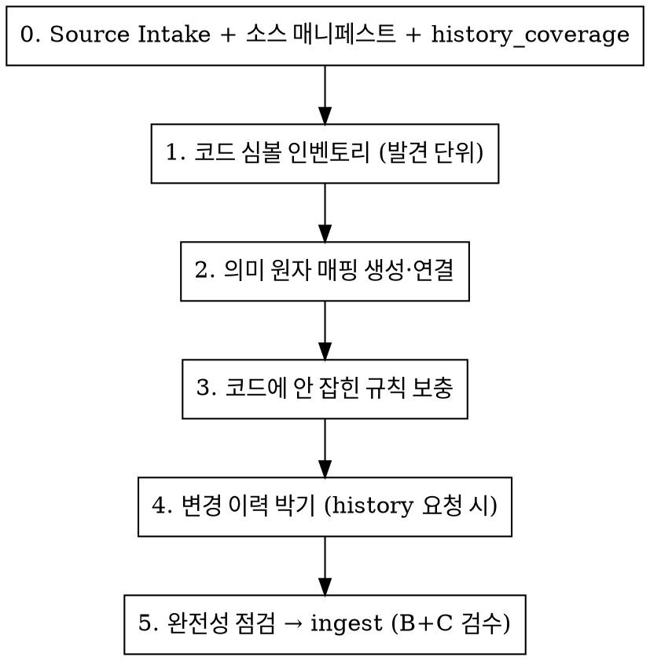
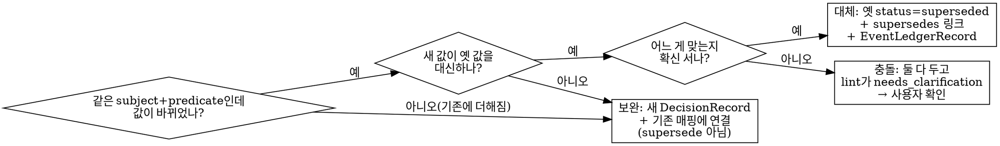

# BB2 Brain 적재 — 완료 스펙 소급

완료된 BB2 기능 하나를 골라, 그 기능의 프로젝트 지식을 Brain 저장소에 객체 그래프로 소급 적재한다.
Brain은 BB2 프로젝트 지식의 단일 저장소이고, 코드에 앵커된 의미 매핑이 Brain을 쓸모있게 만든다.

핵심 입력 설계 문서: `docs/superpowers/specs/2026-06-04-{{PROJECT}}-brain-extraction-guide-design.md`

## 역할 분담 — 먼저 머리에 박아라

추출은 **너(에이전트)의 일**이다. 무엇을 어떤 객체로 뽑고, 무엇에 연결하고, 무엇이 무엇을 대체/충돌/
보완하는지의 **판정은 의미 판단이라 영구히 너의 몫**이다. 코드는 받아서 검증·저장·신호만 한다 —
판정을 코드에 넘기지 마라(코드 자동 비교는 멀쩡한 사실을 잘못 닫는다).

| 역할 | 담당 | 내용 |
|---|---|---|
| 판정 (대체/충돌/보완) | 너 (에이전트) | 의미 판단. 코드로 안 넘긴다 |
| 검증·저장 | 코드 `ingest`/`promote` | 스키마 + 연결 무결성 검사 후 저장 |
| 신호 | 코드 `lint` | 충돌·미반영 표시만 (판정 안 함) |

## 출발 전 — 이 스킬이 맞는 상황인가

이 스킬은 **완료 스펙 소급 적재**만 다룬다(시나리오 나). 다음은 범위 밖이니 멈추고 사용자에게 알려라:

- 진행 중 개발의 실시간 적재 (코드가 아직 확정 안 되고 바뀌는 중) — 시나리오 가, follow-up.
- 끝난 세션 대화 로그에서 지식 마이닝 — 시나리오 다, follow-up.

경계 판단이 애매하면 `references/scope.md`.

## 개념 단위 도메인 적재 — 분기 (기능 단위가 아니라 가로지르는 개념일 때)

대상이 완료된 단일 기능(이벤트/픽스 = **기능 단위**)이 아니라, 여러 기능·코드 모듈을 가로지르는
**개념 단위**(컨텍스트의 단위는 코드 디렉토리가 아니라 "질문/개념" — 설계 §3 결정 1. "~가 어떻게
동작해?"가 한 단위)이면, 아래만 다르고 나머지 절차(절대 규칙·객체 모델·검수)는 그대로다.

- **시나리오는 여전히 (나).** "기능 단위냐 개념 단위냐"는 시나리오(코드 확정 여부)가 아니라
  **DomainContext 경계** 문제다. 코드가 {{DEFAULT_BRANCH}}에 확정돼 있으면 (나)로 적재한다.
- **소스 패킷 기본값 = 코드 정본.** 별도 기획서가 없을 수 있다 — {{DEFAULT_BRANCH}} 코드와
  주석이 1층 진실(정본 순위는 코드 동작 > 주석, 주석은 stale 가능), git 이력은 "왜"의 근거,
  과거 기획서·서버위키 단편은 있으면 보조. 코드로 판정 안 되는 의도는 개발자·사용자 확인.
  근거가 코드 EvidenceRef 한 종류로 쏠려도 허용(기획서 없는 도메인의 정직한 상태 — confidence·
  caveat으로 교차검증 부재를 드러내되 빈 근거 가짜 채움 금지).
- **추출 렌즈 = 착수 브리핑 5요소.** 코드 심볼 인벤토리를 (1) 데이터 출처 (2) 구조·표시 패턴
  (3) 확장 지점 (4) 기존 규칙·함정 (5) 과거 결정으로 훑어 의미 원자를 뽑는다. 특히 **"신종/수정 시
  만지는 곳"을 DomainMapping 하나(확장 지점 종합 매핑)로 모은다** — 회상(조립 모드)이 이 한 매핑으로
  5요소를 빠르게 채우게 하는 게 핵심 산출물이다.
- **경계 = 공통분모만.** 개별 사례의 고유 동작은 `out_of_scope` — 각자 기능 컨텍스트 몫. 개념 단위
  매핑의 주어는 항상 가로지르는 공통 메커니즘이다.
- **★공통 개념 이주 + 교차참조 (놓치기 쉬움 — 설계 §11.4)★**: 여러 기능에 흩어져 있던 공통
  개념을 개념 단위 컨텍스트로 옮길 때(GlossaryTerm은 supersede가 없으니 **제자리 context_id 변경 +
  DecisionRecord(`implementation_boundary`)**, 꿀통 개칭 방식), 두 가지를 반드시 함께 한다:
  1. **이주 선행 — 고아 해소**: 참조 매핑·결정이 0인 용어는 이주만 하면 그래프가 끌어올 엣지가
     없다. 이주 전/동시에 분류 매핑에 `glossary_term_ids`로 엮는다(규칙 7 위반 해소 겸).
  2. **기능 쪽 교차참조 — 양방향 회수 보존**: 이주된 용어는 색인 context_id가 바뀌어 **scope=기능
     하드필터에서 빠진다**. 그 개념을 쓰는 **각 기능 매핑이 그 용어를 `glossary_term_ids`로
     교차참조**해야 기능 핀포인트 질의에서 그래프 동반(linked)으로 따라온다. 안 하면 기능 쪽
     회상이 끊긴다(실측: shootable-bubble-remover 이주 후 hedgehog scope results 0).
- **스냅샷 선언.** "완료" 개념이 없는 살아있는 코드라 "이 시점 {{DEFAULT_BRANCH}} 기준"임을 `commit_sha`로
  박는다(절대 규칙 8 그대로). `feature_done`은 "이 개념이 {{DEFAULT_BRANCH}}에 자리잡음"으로 읽는다.
- **대규모 운영 절차.** 도메인이 클 때(클래스 수십·스프라이트 수백·만 줄 파일·여러 컨텍스트)
  추출 워크플로우·연결을 메인이 조립으로 통제·promote 함수 호출 함정·기존 컨텍스트 확장은
  `references/system-domain-playbook.md`. 작은 개념 하나면 이 분기만으로 충분하다.

## feature_done / current_ingest_done / history_coverage를 분리한다

기능 완료, 현재 사실 적재 완료, 변경 이력 확인 범위는 서로 다른 축이다. Jira/Slack/PR/commit이 없다는
이유만으로 현재 사실 적재가 미완료가 되지는 않는다.

- `feature_done`: 기능이 소급 적재 대상일 만큼 완료됐다는 외부 상태. 사용자 선언, QA/release 맥락, 이슈 상태로
  판단한다. Jira/Slack 데이터 유무가 `feature_done` 조건은 아니다.
- `current_ingest_done`: 현재 {{DEFAULT_BRANCH}} 코드 + 현행 기획서 + 서버위키로 현재 meaning/value/boundary를
  적재·검수한 상태. "뭐야/어디/지금" 질문에 답한다.
- `history_coverage`: 변경 이력 확인 범위. "왜/그때" 질문에만 영향을 준다.

`history_coverage`는 자유 문장이 아니라 아래 고정 literal 중 하나로 `DomainMapping.caveats`나 슬라이스
ingest memo에 남긴다.

- `history_coverage=unsearched`: 현재 사실만 답한다. `why_changed`/`as_of_history`는 "변경 이력 미적재"라고 답한다.
- `history_coverage=partial`: 확인한 이력만 답하고, 빠진 소스를 함께 경고한다.
- `history_coverage=complete`: 현재/왜/그때/근거 질문을 모두 답할 수 있다.

`history_coverage=complete`는 개발 완료 기준도, 현재 사실 적재 완료 조건도 아니다. Jira/Slack/PR/commit은
변경 이력 질문을 답하기 위한 근거다. **complete 판정 기준은 "4종(Jira/Slack/PR/commit)을 다 봤는가"가 아니라
"알려진 변경집합이 전부 EvidenceRef로 연결됐는가"다** — 변경이 없는 부분은 원본 PR 하나만으로도 complete이고,
4종이 모두 있어야 하는 것도 아니다.

## 절대 규칙 (하나라도 어기면 적재 폐기하고 다시)

직전 1차 적재가 "32객체 쓰레기"로 끝난 실패를 직격하는 규칙이다.

1. **`feature_done`, `current_ingest_done`, `history_coverage`를 섞지 않는다.** 기능이 완료됐어도 적재가
   끝난 것은 아니고, 현재 사실 적재가 끝났어도 변경 이력까지 확인한 것은 아니다.
2. **기능명은 대상이지 EvidenceRef가 아니다.** "샐리 카누 brain에 넣어줘"만 받았으면 target만 정해진
   것이다. 소스 패킷을 기본값으로 선언하거나 사용자에게 확인하기 전 객체 생성·심볼 인벤토리·EvidenceManifest를
   시작하지 마라.
3. **EvidenceRef는 이번 소스 패킷만 가리킨다.** 이전 세션·설계문서·작업 히스토리·메모리에서 알아버린
   사실은 객체 근거가 아니다. 의미·경계·값·결정·caveat·code_locator는 이번에 읽은 허용 소스의
   EvidenceRef로 재구성 가능해야 한다.
4. **추측 금지.** 소스에 있는 것만 적재한다. 없는 값은 비워 표시한다. 서버위키처럼 최신이 아닐 수 있는
   소스로 만든 객체는 `confidence`를 낮춘다.
5. **저장 대상에 코드 필터를 걸지 않는다.** 코드에 없는 지식(서버 판정·순수 게임 규칙)도 저장한다.
   "코드에 없으니 저장 안 함"은 틀렸다.
6. **계층이 소스를 가른다.** view 심볼 ↔ 기획서, model 심볼 ↔ 서버위키. 뒤바꿔 매칭하지 않는다.
7. **고아를 만들지 않는다.** 잇는 매핑·결정 없는 용어, 결정 0개인 변경 흔적은 적재 전에 연결하거나 제거한다
   (32객체 실패 패턴의 핵심 원인). 적재 후에도 `project-brain graph isolated`로 잔여/신규 고립을 재점검해
   (a)즉시 연결 (b)의도적 종착점이라 둠 (c)rejected·제거 중 하나로 판정한다(절차는 `references/ingest-tools.md`
   "적재 후 확인" 5단계). **연결 정책** — 기존 매핑에 union할 때는 primary 1개 + 진짜 공동 primary(코드가
   구조적으로 둘 이상 매핑에 실제 참여)만 잇고, 약한 secondary는 희석(매핑끼리 코드목록 중복으로 회상 신호
   약화) 방지로 제외한다. 연결성·완전성이 목표인 작업(고립 정비 등)에서 "최소 1엣지만"이라는 단순함 기본값을
   의심하되, 무제한도 아닌 "진짜 공동 primary까지"가 중간 길이 정답이다(LLM 최소변경 편향이 작업 목표를
   이기지 못하게 하는 가드).
8. **코드 앵커는 {{DEFAULT_BRANCH}} 기준 `commit_sha`.** 작업 브랜치가 아니라 {{DEFAULT_BRANCH}}의 심볼을 박는다(줄번호는 엔진이 저장 안 함 — 심볼+`commit_sha`가 앵커).
   `mapping_key`는 논리적 의미, `code_locator`가 코드 앵커다(심볼 rename에 견고하도록 의미와 앵커를 분리).
   **`commit_sha` 필드 기입은 의무다(스키마상 선택이어도).** 심볼을 확인한 코드의 기준 커밋을
   `git rev-parse --short=10`으로 떠서 모든 CodeLocator에 채운다 — 비워두면 나중에 코드가 바뀌었는지
   판별할 기준점이 없다. (2026-06-12 실측: 351개 중 348개가 공백이라 검증 동반 소급 기입으로 수습,
   그 과정에서 라인 어긋남 3건과 {{DEFAULT_BRANCH}} 신코드 기준 1건이 뒤늦게 발견됨.)

letter를 어기는 것은 spirit을 어기는 것이다. "이번 건 코드가 명백하니 기획서 생략" 같은 변형도 위반이다.

## 객체화 경계 — 독립 회상 가치 (정본 §7 미결 8 기준, 2026-06-10 확정)

무엇을 객체로 만들고 무엇을 raw에 남기는지의 실무 기준:

- **객체 저장 기준 = "독립적으로 질문되고, 독립 근거를 가질 수 있는가"** — 의미 원자 승격
  기준과 같은 축이다. 코드 연관은 기준이 아니라 **근거의 한 종류**일 뿐이다(규칙 5와 일관 —
  서버 판정·순수 규칙은 코드 없어도 저장).
- **기획서의 개념 서술(세계관·컨셉·연출 설명)은 객체화하지 않는다** — "어차피 기획서에 다
  있음"(06-04 원장). raw 보관(`raw/sources/`)이 커버하고, 본문 검색은 추후 raw 색인이 맡는다.
  그때까지 개념 서술이 검색에 안 잡히는 공백은 감수한다(사용자 합의).
- **정의가 근거를 초과하면 안 된다** — 용어/매핑의 정의는 근거(EvidenceRef)가 보증하는
  범위까지만. 2026-06-09 커버리지 검증에서 hold 24건이 전부 이 위반(폰트 상수·멤버 선언·
  매크로처럼 매핑 검증 의미를 넘는 정의)이었다.
- **인사이트는 Insight kind로 적재** (2026-06-15 신설, 정본 §7 미결 1 해소) — 2개 이상
  객체·구현·결정을 가로지르는 관찰/위험/교훈일 때(단일 코드/결정/용어가 아니라 그 위에 얹히는
  메타 관찰). 적재가 특수하니(candidate 거부·reviewed 직접·source 개수·진술 근거) 절차는
  `references/object-model.md` "Insight 적재 규칙"을 따른다.

## Source Intake Gate — 먼저 선언하고, 예외만 묻는다

기능명만 받은 상태에서 바로 `rg`/wiki/handoff/memory로 뛰지 마라. 먼저 target과
source packet을 분리해서 선언한다.

기본값: 사용자가 기능명만 말하고 소스·이력 범위를 지정하지 않으면 아래로 진행한다.

- target: 사용자가 말한 기능/이벤트.
- 목표: `current_ingest_done`.
- source packet: 현재 {{DEFAULT_BRANCH}} 코드 + 현행 기획서 + 서버위키.
- history: `history_coverage=unsearched`.

이 기본값을 한 줄로 알리고 진행한다. 단, 소스 위치를 찾을 수 없거나 사용자가 "내가 준 파일만 써"처럼
수집 방식을 제한했으면 멈추고 짧게 묻는다.

사용자에게 묻는 질문은 3개를 넘기지 않는다:

1. 현재 사실만 적재할지, 변경 이력까지 포함할지.
2. 에이전트가 코드/기획서/서버위키 위치를 찾아도 되는지, 사용자가 준 소스만 써야 하는지.
3. 변경 이력 포함이면 Jira/Slack/PR/commit 중 어디까지 확인할지.

세부 의미 원자마다 인터럽트하지 마라. 소스가 일치하면 조용히 후보를 만들고, 애매한 것만 **예외 큐**로 묶어
사용자 확인에 올린다. 예외 큐 대상은 소스 충돌, 현행 소스 부재, 값은 있는데 경계가 불명확한 경우,
`history_coverage=complete` 선언에 필요한 이력 소스 누락, 독립 의미 원자 승격 여부가 결과를 바꾸는 경우다.

## 추출 5단계 (코드가 뼈대)

완성 스펙은 코드가 "실제 구현 경계"의 진실이라 코드를 뼈대로 삼는다. 심볼이 어느 **계층**이냐가
어느 **소스**를 봐야 하는지를 알려준다 — view는 기획서, model은 서버위키.

> 조립·적재는 `scripts/`로 시스템화됨: `domain_spec.py`(데이터) + `extract_template.js`(추출) + `assemble_notes.py`(조립) + `run_ingest.sh`(적재 후 단계). 결정은 `decisions[]` 노트로(손조립 금지 — `references/object-model.md`). 상세 = `references/ingest-tools.md`.

### 0. Source Intake + 도메인 컨텍스트 + 소스 매니페스트
- `DomainContext` 1개: 경계(`boundary_summary`, `in_scope`/`out_of_scope`). 개발 단계(알파/베타/리얼)로
  도메인을 나누지 마라 — 단계는 evidence의 출처·시점(provenance)이지 도메인 칸이 아니다.
- 소스마다 `EvidenceManifest` 1개. `source_type`은 spec/wiki/code_search/jira/slack/pr/commit에서 고른다.
  sanity/hotfix는 `source_type`이 아니라 `DecisionRecord.decision_type`이다. 기획서는 마크다운 원문을
  brain raw에 보관, 서버위키·세션은 링크만(`locator`=URL).
- 소스 단계와 `history_coverage`를 먼저 정한다.
  - 1층 의미 골격: 현재 {{DEFAULT_BRANCH}} 코드 + 현행 기획서 + 서버위키. `current_ingest_done` 가능.
  - 2층 변경 이력: Jira/Slack/PR/commit에서 QA·sanity·hotfix·개선 이유를 확인. `history_coverage=complete` 가능.
  - wiki/handoff/memory는 사용자가 이번 source packet에 넣겠다고 정하지 않는 한 EvidenceRef가 아니다.

### 1. 코드 심볼 인벤토리 (뼈대)
Source Intake가 끝난 뒤 {{DEFAULT_BRANCH}} 기준으로 대상 클래스를 계층별로 나열한다(`rg` 탐색, 앵커 라인은
`git show`로 {{DEFAULT_BRANCH}} 확정). 검색 결과는 code source packet에 포함된 경우에만 EvidenceRef가 된다.

| 계층 | 무엇 | 봐야 할 소스 |
|---|---|---|
| view (UI·흐름) | 팝업·레이어·노드·플로팅버튼 | **기획서 기능** |
| model (데이터) | EventModel·Info·Manager·RankingModel | **서버위키 API** |
| presenter (변환) | Presenter·ViewData | 둘을 잇는 가공 |

코드 심볼은 **발견/커버리지 단위**이고, 저장 단위는 **의미 원자**(`subject + predicate + boundary`)다.
1-pass로 클래스를 큰틀에서 기획서/서버위키와 매칭하고, 2-pass로 독립된 규칙/동작을 담은 public 메서드를
별도 `DomainMapping`으로 승격한다.

쪼개는 기준: **독립적으로 질문되고, 독립 근거를 가지며, 독립 변경 이력을 가질 수 있으면 별도 의미 원자다.**
enum 값은 기본적으로 한 의미 원자의 값 목록이다. 단 특정 값이 독립 행동 규칙·독립 근거·독립 변경 이력을
가지면 별도 의미 원자로 승격한다. private 헬퍼·UI 좌표·스프라이트명 같은 단순 구현 디테일은 매핑 안 함.

### 2. 심볼마다 소스 붙여 매핑 생성·연결
심볼 하나를 잡고 "무엇이고 어떤 규칙인가"를 그 계층의 매칭 소스에서 찾아 객체를 만들고 그 자리에서
연결한다. 만들 객체 종류·필수필드·enum·연결 규칙은 **`references/object-model.md`**.

### 3. 코드에 안 잡힌 규칙 보충
기획서 기능 목차를 체크리스트로 훑어, 코드 뼈대에서 안 잡힌 서버·순수 규칙(선착순 N위 보상·완주 기준·
참가 인원)을 찾는다. **이들도 객체로 저장하되, 값을 받아 표시하는 코드 지점이 있으면 거기에 "클라 경계"로
연결한다.** 코드 흔적이 정말 0인 것만 코드 연결 없이 둔다.

### 4. 변경 이력 박기 (history 요청 시)
완성 스펙은 알파→베타→리얼을 거치며 이미 바뀐 이력이 있을 수 있다. 이 2층까지 확인하면 "시간차 갱신"이
아니라 **완결된 이력으로 한 번에** 적재한다. QA·개선·sanity·hotfix 결정을 `DecisionRecord`로(영향
매핑/사실에 연결), `spec_reflected`로 "Jira엔 있지만 기획서 미반영(`no`=drift)"을 추적한다.

2층을 아직 안 봤거나 일부만 봤으면 이력 완료라고 쓰지 않는다. 해당 매핑 `caveats`나 슬라이스 memo에
`history_coverage=unsearched` 또는 `history_coverage=partial`을 남기고, why/as-of 질의는 차단한다.

판정은 네가 한다(코드는 신호만):

상세 판정 규칙은 `references/judgment.md`.

### 5. 완전성 점검 → ingest (B+C 검수)
아래 자가 점검 후 적재한다. 검수 방식은 **B+C 하이브리드**(design-hub §8): 검증된 근거 + 적대검증 통과 + lint clean이면
`reviewed`로 직접 적재한다(B — 사람 손 0). 근거 약함·소스 충돌·적대검증 실패는 `candidate`로 둔다(C). 현재 라우터의
C 노출은 candidate **용어(GlossaryTerm)** 정의에 적용된다 — `glossary_meaning` 질의에서 "확인 필요" 라벨로 보인다.
candidate **매핑**은 저장되지만 현 라우터가 아직 노출하지 않으니(silent), 사용 시점에 사람이 `project-brain promote`로 확정해
reviewed로 올린다. 사람의 upfront 확인은 시스템이 스스로 못 가른 예외(예외 큐)만 — 전수 검수가 아니다. 1층만 완료한 매핑도 `current_ingest_done`으로 적재할 수 있지만,
`history_coverage=complete`가 아니면 이력 질문을 답하지 않는다.

## 완전성 자가 점검 (lint가 못 보는 부분)

`ingest`/`lint`는 "없는 id 참조·충돌·고아"만 잡고 **"규칙이 빠졌다"는 못 잡는다.** ingest 직전에 네가 점검:

1. Source Intake로 target/source packet/history_coverage 기본값 또는 사용자 지정 범위를 선언했나.
2. 코드 심볼 인벤토리(클래스 + 승격 메서드)가 전부 매핑됐나.
3. 기획서 기능 목차 대비 빠진 규칙이 없나.
4. 각 `DomainMapping`에 `history_coverage=unsearched`, `history_coverage=partial`,
   `history_coverage=complete` 중 정확히 하나가 남았나.
5. `history_coverage=complete`인 매핑은 Jira/Slack/PR/commit 이력까지 EvidenceRef로 재구성 가능한가.
6. reviewed `DomainMapping`·`GlossaryTerm`이 검증된 근거(`evidence_refs`)를 가졌나 — §6.4가 schema로 강제한다
   (근거 빈 reviewed는 거부). 코드앵커는 근거의 한 종류일 뿐 필수가 아니다. 코드로 표현되는 매핑이면 `code_locator`로
   잇고, 코드 흔적이 0인 서버·순수 규칙은 서버위키·기획서 근거로 잇고 왜 코드앵커가 없는지 `boundary`/`caveats`에 적었나.
7. 고아 없나(잇는 매핑/결정 없는 용어, 결정 0개인 변경 흔적) — 적재 후 `project-brain graph isolated`
   재점검까지 본다(절대 규칙 7·`references/ingest-tools.md` "적재 후 확인" 5단계).

상세·진단 신호는 `references/completeness-checklist.md`.

## 적재 실행 (B+C — ingest, 그리고 reviewed 적재)

정확한 호출(CLI/시그니처/가드/저장 레이아웃)은 `references/ingest-tools.md`. 큰 흐름:

1. **검증·적대검증.** 추출한 묶음의 각 매핑이 검증된 근거(`evidence_refs`)를 갖고 적대검증(추출→반박 워크플로우 등)을
   통과하는지 본다. 코드앵커는 근거의 한 종류일 뿐 필수가 아니다(서버규칙은 기획서·서버위키 근거).
2. **적재.** `project-brain ingest --objects-file`로 묶음을 적재한다(스키마·연결무결성 통과 시 저장, 실패 시 아무것도 안 쓰고
   에러 = 원자적; 같은 id 재적재 멱등).
   - **검증 통과 + lint clean → `status:"reviewed"`로 직접 적재(B, 사람 0).** ingest는 후퇴(reviewed→candidate)만
     막으므로 reviewed로 넣으면 그대로 검수됨. 묶음 단위 승격이 필요하면 `promote(scope="mapping_bundle", bundle_key=...)`
     결과(reviewed 객체 + ReviewRecord)를 다시 `ingest`.
   - **근거 약함·충돌·검증 실패 → `candidate`로 적재(C).** 현재 라우터의 C 노출 대상은 candidate **용어** 정의
     (`glossary_meaning` 질의에서 "확인 필요" 라벨). candidate **매핑**은 아직 라우터가 노출하지 않으니 사용 시점에
     사람이 `project-brain promote`로 확정한다.
3. **예외만 사람에게.** 시스템이 스스로 못 가른 충돌·경계 불명확만 예외 큐로 묶어 사용자 확인에 올린다(전수 검수 아님).

## Common Mistakes

| 실수 | 바로잡기 |
|---|---|
| 기능이 완료됐으니 적재도 완료됐다고 말함 | `feature_done`, `current_ingest_done`, `history_coverage`를 분리한다 |
| reviewed니까 이력까지 답함 | `history_coverage=complete`가 아니면 왜/그때 질문 차단 |
| 기능명만 듣고 바로 코드 검색 | 기능명은 target이다. Source Intake로 source packet을 선언한 뒤 탐색한다 |
| 최초 기획서만 보고 적재 | 현재 기획서만으로는 1층 current만 가능. 변경 이력 없으면 `history_coverage=unsearched` 또는 `history_coverage=partial` |
| 이전 세션에서 안 사실을 근거로 씀 | EvidenceRef는 이번 소스 패킷만 가리킨다. 메모리·설계문서·작업 히스토리는 객체 근거가 아니다 |
| 코드 없는 규칙을 건너뜀 | 저장한다. 표시 코드 있으면 클라 경계로 연결, 없으면 코드 연결 없이 둠(규칙 5) |
| 애매한 의미 원자마다 질문함 | 조용히 후보를 만들고, 진짜 충돌·경계 문제만 예외 큐로 묶어 사용자 확인에 올린다 |
| 용어만 만들고 매핑에 안 엮음 | 고아. 매핑/결정에 연결하거나 제거(규칙 7) |
| 소스에 없는 값 추측으로 채움 | 비워 표시. 서버위키 기반은 confidence 낮춤(규칙 3) |
| 작업 브랜치를 앵커로 박음 | {{DEFAULT_BRANCH}} 기준 commit_sha·심볼(규칙 8) |
| 기획서 개념 서술(세계관·컨셉)을 객체로 쪼갬 | 객체화 금지 — raw 보관이 커버(객체화 경계) |
| 정의가 근거를 초과함(폰트 상수·매크로 등 매핑 검증 의미 밖) | 정의는 근거가 보증하는 범위까지만(객체화 경계) |
| 검증 없이 바로 reviewed | B는 검증된 근거 + 적대검증 통과 + lint clean일 때만 reviewed 직접 적재. 그게 안 되면 candidate로 두고 C(질의 시 "확인 필요" 노출 + 사용 시점 `project-brain promote`) |
| reviewed인데 근거(`evidence_refs`)를 안 닮 | §6.4: reviewed `DomainMapping`·`GlossaryTerm`은 `evidence_refs` non-empty를 schema가 강제한다. 단 `code_locator_ids`는 비강제(코드앵커는 근거의 한 종류) — 서버규칙은 기획서·서버위키 근거면 reviewed |
| 공통 개념을 개념 단위로 이주만 하고 기능 매핑 교차참조 안 함 | 이주 용어는 scope=기능 필터서 빠진다 — 그 개념 쓰는 각 기능 매핑이 `glossary_term_ids`로 이주 용어를 교차참조해야 기능 핀포인트 회상이 산다(개념 단위 분기) |
| DecisionRecord를 손으로 extra_objects에 조립 | `decisions[]` 노트로 쓴다 — 엔진 build_decisions가 조립·양방향 자동(타임스탬프 churn 방지) |

## Red Flags — 멈추고 다시 시작

- "코드가 명백하니 기획서는 생략해도…"
- "기능이 완료됐으니 Jira/Slack 없이도 이력까지 완료라고 봐도…"
- "reviewed니까 왜 바뀌었는지도 답해도…"
- "기능명은 받았으니 바로 코드 검색부터…"
- "왜 바뀌었는지는 예전 세션에서 봤으니…"
- "이건 코드에 안 잡히니 저장 안 해도…"
- "Jira/Slack은 양이 많으니 최초 기획서로 갈음…"
- "애매한 값 하나마다 사용자에게 물어보자…"
- "라인 정확히 모르겠지만 대충 이쯤…" (소스에 없는 라인 추측)
- "용어는 만들었는데 연결할 매핑이 마땅치 않아 일단 둠"

전부 적재 폐기하고 절대 규칙으로 돌아가라.

## 용어 동의어 — 검색 어휘 넓히기 (선택, recall 보강)

GlossaryTerm 노트(`glossary[]`)에 `synonyms`/`aliases`를 채우면 다른 어휘로 물어도
그 용어를 찾는다(BM25 recall + 색인 표면 확장 — `surface.py`가 이미 읽는다). 우선순위:

1. **한국어↔영문 등가어 (최우선).** term이 영문 코드명·enum·메시지키면 한국어로
   부르는 말을 넣는다. 예: `CLEAR_PASS_TICKET_RECOVER` → `["클리어 패스 티켓 복구",
   "토큰 환불 복구"]`. (코퍼스 term의 다수가 영문이라 효과가 가장 크다.)
2. **기획서·구어 표현.** 같은 대상을 다르게 부르는 말. 예: 입장팝업 → `["시작 팝업"]`.
3. **코드 식별자 변형.** 약어·대소문자. 예: `getNextLevel` → `["NL", "NextLevel"]`.

지켜야 할 두 규칙:
- **흔한 단일어 금지.** "팝업"·"이벤트"·"모드" 같은 일반어는 넣지 마라 — 답변 게이트의
  표면 앵커(df)를 흔들어 "기록 없으면 없다"는 거짓양성 가드를 약화시킨다. 고유성 있는 구(句)만.
- **definition 본문에 이미 있는 단어는 넣지 마라** — 이미 색인된다. 동의어 자리엔
  본문에 없는 다른 표현만 넣어 어휘를 넓힌다.

기존 용어에 뒤늦게 채울 때는 `updates[]`의 `union`으로 합친다(덮어쓰기 아님):
`{"id": "g.<ctx>.<key>", "expected_updated_at": "<현재값>", "union": {"synonyms": [...]}}`.

## raw · 저장 정책

- **기획서**: 마크다운 변환 원문을 `{{BRAIN_ROOT}}/raw/sources/<context-slug>/<원본 파일명>`에 보관한다.
  텍스트만 git 추적(바이너리는 로컬), manifest의 `locator`는 brain root 기준 상대 경로 —
  규약 정본은 `{{BRAIN_ROOT}}/README.md` (brain root = 레포 루트 `{{BRAIN_ROOT}}/`, 2-레포 분리 2026-06-11).
- **서버위키·세션**: 링크만(`EvidenceManifest.locator`). 원문 미보관.
- **파괴적 일괄 작업 전 커밋 먼저**: {{BRAIN_ROOT}}/은 git 추적이므로 promote-auto·일괄 상태 변환처럼
  많은 객체를 한 번에 바꾸는 작업 전에는 되돌릴 기준 커밋을 만든 뒤 돌린다(2026-06-09 부분
  쓰기 사고 교훈).

## 참고 파일 — 언제 뭘 읽나

- `references/scope.md` — 이 스킬이 맞는 상황인지(완료 소급 vs 범위 밖) 애매할 때.
- `references/object-model.md` — 객체를 실제로 만들 때. kind별 필수필드·enum·truth_role·연결·실물 JSON 예시.
- `references/ingest-tools.md` — 적재를 실행할 때. `ingest`/`promote` 호출·가드·저장 레이아웃.
- `references/judgment.md` — 변경 이력을 박을 때. 대체/보완/충돌 판정 규칙.
- `references/completeness-checklist.md` — 적재 전 완전성 점검 상세·진단 신호.
- `references/worked-example.md` — 전체 흐름이 한눈에 필요할 때. 샐리 카누 참여 가능 조건 한 슬라이스를 끝까지.
- `references/system-domain-playbook.md` — 대규모 시스템 도메인(기획서 없는 코드 정본·여러 컨텍스트)을 적재할 때. 추출→검증 워크플로우·연결 조립 통제·promote 함수 호출·기존 컨텍스트 확장.

검증: 무결성(`project-brain lint` — 끊긴 참조 0) + 실코퍼스 가드(`python3 -m unittest discover -s {{BRAIN_ROOT}}/checks` — 표준 unittest, pytest 불필요. 적재로 수치 바뀌면 의식적 갱신) +
색인 재생성(`project-brain index rebuild`) + 골든셋 회귀(`project-brain eval`) +
`project-brain search` 샘플 회상으로 새 store가 스스로 답하는지 확인. eval/search 출력은 `2>/dev/null | jq`로 읽는다(eval 통과수=`.summary`, search 적중=`.results`; stdout=깨끗한 JSON·노이즈는 stderr — `2>&1` 손파싱 금지)
(정확한 호출은 `references/ingest-tools.md` "적재 후 확인". 엔진 자체 테스트는
엔진 레포 몫 — 합성 데이터만이라 적재와 무관).
